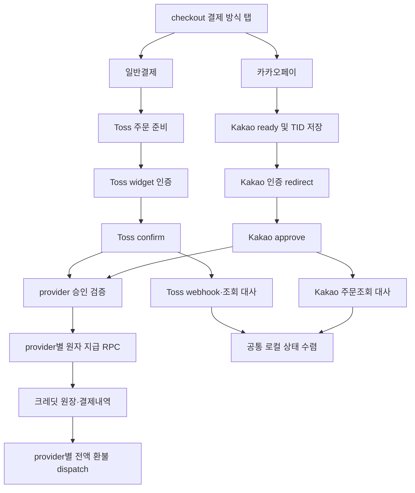

# 일반결제(Toss Payments)·카카오페이 직접결제 탭 구현 계획

## 1. 문서 목적

이 문서는 `/checkout`에서 결제수단을 아래 두 탭으로 분리하는 구현 계획이다.

- `일반결제`: 기존 Toss Payments 결제위젯 v2를 사용한다.
- `카카오페이`: KakaoPay 신규 온라인 결제 API를 직접 연동한다.

단순히 탭 UI만 추가하는 작업은 아니다. 현재 주문·승인·원자 지급·환불·대사가 Toss 전용 계약이므로, KakaoPay를 별도 provider로 안전하게 추가한 뒤 UI를 여는 순서로 진행한다.

본 계획의 완료 조건은 다음과 같다.

1. 기존 Toss 결제·환불·웹훅 흐름에 회귀가 없다.
2. 사전운영 KakaoPay 테스트 결제는 `environment=test`로 식별 가능하며, 실제 운영 전환 전 test-derived spendable credit를 모두 정리한다.
3. 두 provider 모두 승인 성공 뒤 크레딧이 정확히 한 번만 지급된다.
4. 전액 환불과 장애 복구가 provider별 조회 결과를 기준으로 수렴한다.
5. 일반결제 탭에는 카카오페이가 중복 노출되지 않는다.
6. KakaoPay 승인 전에는 운영 탭을 노출하지 않고, 승인 후 DB runtime flag로 점진 활성화할 수 있다. 배포 환경변수는 기본값일 뿐 즉시 차단 수단으로 간주하지 않는다.

작성 기준일은 2026-08-18이다.

## 2. 타당성 결론

요청한 구성은 기술적으로 타당하다. 다만 다음 두 접근을 구분해야 한다.

| 접근 | 설명 | 판정 |
| --- | --- | --- |
| Toss 안에서 결제수단만 두 탭으로 표현 | 두 탭 모두 Toss 주문·승인을 사용한다. 구현은 작지만 KakaoPay 직접계약을 사용하지 않는다. | 이번 요청과 불일치 |
| Toss 일반결제 + KakaoPay 직접 연동 | 주문·승인·조회·취소 adapter와 상태를 provider별로 분리한다. | 채택 |

채택안은 다음 원칙을 따른다.

- 기존 Toss API URL, Toss 승인 함수, `finalize_toss_payment`, Toss 웹훅 URL은 첫 릴리스에서 유지한다.
- KakaoPay 관련 스키마·route·adapter·RPC는 additive하게 추가한다.
- 공통화는 실제 consumer가 두 곳 이상인 주문 준비, 환불 dispatch, 대사 dispatch에만 적용한다.
- KakaoPay 기능 플래그는 기본 `false`이며 테스트·운영 게이트를 통과한 뒤에만 켠다.
- 초기 KakaoPay 출시는 `MONEY`만 허용한다. `CARD`는 운영 승인 후 별도 범위로 검토하며 초기 schema·adapter·UI에는 카드 선택과 카드 전용 응답 처리를 추가하지 않는다.
- Toss 결제 어드민에서 일반결제 전용 variant를 만들고 카카오페이를 제외한다. 브라우저에서 CSS나 JavaScript로 Toss 결제수단을 숨기지 않는다.

## 3. 확인한 공식 문서

### Toss Payments

- [결제위젯 v2 LLM Quick Reference](https://docs.tosspayments.com/guides/v2/get-started/llms-quick-reference)
- [결제창형 가이드(현재 주문서형 구현과 구분용)](https://docs.tosspayments.com/guides/v2/payment-widget/integration-window)
- [결제 어드민 설정](https://docs.tosspayments.com/guides/v2/payment-widget/admin)
- [JavaScript SDK v2](https://docs.tosspayments.com/sdk/v2/js)
- [API 키](https://docs.tosspayments.com/reference/using-api/api-keys)
- [인증 헤더](https://docs.tosspayments.com/reference/using-api/authorization)
- [코어 API](https://docs.tosspayments.com/reference)
- [웹훅 연결](https://docs.tosspayments.com/guides/v2/webhook)
- [배포 체크리스트](https://docs.tosspayments.com/guides/v2/deploy-checklist)

확인된 계약:

- 현재 일반결제는 Toss Payments 결제위젯 v2 **주문서형 결제**다. `widgets()` → `setAmount()` → `renderPaymentMethods()` → `renderAgreement()` → `requestPayment()` → `successUrl` → 서버 confirm 순서를 유지한다. `renderPaymentWindow()`/`paymentRequest`를 쓰는 결제창형 전환은 범위 밖이다.
- 서버 API는 `Authorization: Basic base64(secretKey:)`를 사용한다.
- 결제창 인증은 30분, 인증 후 승인은 10분 안에 처리해야 한다.
- `PAYMENT_STATUS_CHANGED` 웹훅을 지원한다.
- 결제위젯 variant별로 노출 결제수단을 다르게 설정할 수 있다.

### KakaoPay

- [온라인 결제 이해하기](https://developers.kakaopay.com/docs/payment/online/common)
- [단건 결제](https://developers.kakaopay.com/docs/payment/online/single-payment)
- [주문 조회](https://developers.kakaopay.com/docs/payment/online/payment-detail)
- [결제 취소](https://developers.kakaopay.com/docs/payment/online/cancellation)
- [애플리케이션 기본 정보](https://developers.kakaopay.com/docs/getting-started/applications/basic-info)
- [플랫폼 등록](https://developers.kakaopay.com/docs/getting-started/applications/platform)
- [신규 API 전환 가이드](https://developers.kakaopay.com/docs/payment/online/change)
- [웹훅 미지원 공식 포럼 답변](https://developers.kakaopay.com/forum/t/webhook/1394)

확인된 계약:

- 테스트는 `TC0ONETIME`과 `Secret key(dev)`를 사용한다.
- 신규 API는 `Authorization: SECRET_KEY ...`, `Content-Type: application/json`을 사용한다.
- ready 응답의 `tid`를 redirect 전에 주문과 매핑해 저장해야 한다.
- 승인 callback의 `pg_token`으로 approve API를 호출한다.
- ready 유효시간은 15분이다.
- 등록한 Web 플랫폼 도메인과 callback URL의 도메인이 일치해야 한다.
- 공개 문서와 공식 포럼 기준 현재 별도 결제 웹훅은 제공되지 않는 것으로 확인했다. 운영 계약 시 담당자에게 다시 확인하되, webhook 제공 여부와 무관하게 주문 조회 대사를 유지한다.

### Scheduler

- [Vercel Cron 관리](https://vercel.com/docs/cron-jobs/manage-cron-jobs)
- [Supabase Cron](https://supabase.com/docs/guides/cron)
- [Supabase Edge Function 예약 실행](https://supabase.com/docs/guides/functions/schedule-functions)

확인된 계약:

- 현재 Vercel Hobby의 Cron은 하루 한 번만 실행할 수 있고 실패 자동 재시도가 없어 15분 만료 결제 대사에 사용할 수 없다.
- Supabase Cron은 `pg_cron`으로 분 단위 실행이 가능하고, `pg_net`과 Vault를 조합해 인증된 HTTP endpoint를 호출할 수 있다.

## 4. 현재 저장소 기준선

### 4.1 현재 흐름

- `src/app/checkout/page.tsx`: 로그인, 사용자, 활성 상품, Toss checkout 설정을 조회한다.
- `src/app/checkout/checkout-client.tsx`: mount 직후 Toss 주문을 생성하고 위젯을 초기화한다.
- `src/app/api/payments/orders/route.ts`: Toss 환경·MID를 검증하고 `provider = 'toss'` 주문을 생성한다.
- `src/app/api/payments/confirm/route.ts`: Toss 승인 응답을 검증하고 `finalize_toss_payment`를 호출한다.
- `src/lib/toss-payments-server.ts`: Toss 승인·조회·취소와 허용 결제수단을 담당한다.
- `src/lib/payment-reconciliation-server.ts`: Toss 상태 조회로 지급·환불 상태를 복구한다.
- `src/lib/point-charge-refunds-server.ts`: 함수명은 일반적이지만 실제 RPC는 모두 `*_toss_refund`다.
- `src/app/api/payments/webhooks/toss/route.ts`: Toss 웹훅 중복 제거와 대사 진입점이다.
- `src/app/api/internal/payments/reconcile/route.ts`: `CRON_SECRET`으로 보호된 대사 endpoint다.

### 4.2 현재 DB 제약

- `payment_orders.provider`는 `toss`만 허용한다.
- `mid`, `payment_key`, `provider_status`와 Toss 멱등키가 주문에 결합돼 있다.
- `finalize_toss_payment`는 Toss `DONE`과 MID를 전제로 지급한다.
- 환불 RPC와 관리자 환불 route는 Toss 취소만 호출한다.
- `payment_webhook_events`는 Toss transmission ID를 기준으로 한다.
- 사용자는 현재 `payment_orders` 전체를 직접 SELECT할 수 있어 callback state 같은 민감값을 같은 테이블에 추가하면 안 된다.

### 4.3 확인된 drift와 운영 공백

- `src/types/supabase.ts`에는 이미 적용된 결제 table·column·RPC 일부가 누락돼 있다.
- `env.local.example`에는 현재 Toss·웹훅·대사에 필요한 변수도 빠져 있다.
- 저장소에는 대사 endpoint를 실제 주기 호출하는 scheduler 설정이 없다.
- 현재 finalizer는 `payment_orders.environment = test`인 주문도 소비 가능한 크레딧으로 확정할 수 있다.
- 기존 관련 기준선 테스트는 38개 중 37개가 통과했고, `tests/pricing-refund-summary.test.mjs`의 과거 `AI 생성` 문구 기대 1개가 실패했다. 이 실패는 이번 구현 전부터 존재한 항목으로 별도 처리한다.

## 5. 목표 아키텍처



### 5.1 공통 원칙

- 내부 주문의 `provider`, provider 환경, 가맹점 식별자, 금액, 크레딧, 세금 snapshot은 생성 후 변경하지 않는다.
- 모든 크레딧 상품 가격은 부가세 포함 총액이다. 서버는 `tax_free_amount = 0`, `vat_amount = round(total_amount / 11)`로 계산하고 ready·approve·조회·취소 전 과정에서 같은 snapshot을 검증한다.
- 클라이언트는 가격·크레딧·provider 상태를 확정하지 않는다.
- provider redirect는 UX 신호일 뿐 결제 완료 근거가 아니다.
- provider 승인 응답과 fresh 조회 결과를 서버 주문과 대조한 뒤에만 크레딧을 지급한다.
- 동일 callback, 새로고침, 병렬 요청, 응답 유실에도 지급·환불은 한 번만 확정한다.
- 승인 여부가 모호하면 새 결제를 만들지 않고 조회·대사 또는 `manual_review`로 보낸다.

### 5.2 Toss 흐름

1. 사용자가 `일반결제` 탭에서 CTA를 누른다.
2. 서버가 Toss 주문을 생성하거나 동일 checkout attempt의 기존 주문을 반환한다.
3. 활성 Toss panel이 서버 주문 금액으로 위젯 금액을 맞추고 `requestPayment()`를 호출한다.
4. 기존 `/checkout/success`와 `/api/payments/confirm` 흐름을 유지한다.
5. 기존 `finalize_toss_payment`가 원자 지급한다.
6. Toss 웹훅과 Toss 조회 대사가 현재 흐름을 유지한다.

### 5.3 KakaoPay 흐름

1. 사용자가 `카카오페이` 탭에서 CTA를 누른다.
2. 서버가 로컬 주문을 먼저 생성하고 `payment_method_type = MONEY`로 고정해 Kakao ready API를 호출한다. 클라이언트의 결제수단 값은 받거나 신뢰하지 않는다.
3. ready 응답의 `tid`, CID, callback state hash를 저장한 뒤에만 redirect URL을 클라이언트에 반환한다.
4. callback route가 one-time state와 주문을 검증하고 `pg_token`으로 approve API를 호출한다.
5. approve 응답에 실제 존재하는 CID, TID, AID, partner order/user, 금액, 세금, 승인시각을 검증한다. 이어 fresh order 조회의 동일 식별자·금액·세금과 `SUCCESS_PAYMENT`를 확인한다.
6. fresh order 검증을 통과한 경우에만 `finalize_kakaopay_payment`가 원자 지급한다.
7. callback route는 `pg_token`이 없는 안전한 결과 URL로 즉시 redirect한다.
8. callback이 도달해 `pg_token`을 확보한 뒤 approve 결과가 유실되거나 DB 처리가 실패한 경우에만 TID 주문조회와 원자 finalizer로 복구한다.
9. callback이 서버에 전혀 도달하지 않은 경우에는 `pg_token`이 없으므로 approve를 복구할 수 없다. 주문조회로 미승인을 확인하고 15분 뒤 실패·만료로 종결하며 크레딧은 지급하지 않는다.
10. ready 결과가 불명확해 TID를 저장하지 못한 경우에는 자동 ready 재호출로 orphan TID를 늘리지 않고 `ready_unknown`으로 격리한 뒤 명시적 새 시도만 허용한다.

## 6. 데이터 모델 계획

기존 20260805 migration과 과거 drift 파일은 수정하지 않고 순서가 고정된 additive migration을 만든다. 각 신규 migration은 shared DB에서 짧은 `lock_timeout`을 설정한 `BEGIN … ROLLBACK` rehearsal과 schema contract를 먼저 통과한 뒤 적용한다. 적용 후 원격이 부여한 version·name을 local migration과 정확히 맞추고 다음 단계로 이동한다.

### 6.1 결제 시도와 `payment_orders`

provider 선택 전에 한 번만 발급되는 `checkout_attempts`를 추가한다.

- `checkout_attempt_id`: 최소 128-bit 랜덤 UUID, `(user_id, checkout_attempt_id)` UNIQUE
- `request_fingerprint`: user, plan, provider, 금액·크레딧 snapshot의 canonical hash
- `claimed_provider`: 첫 ready 요청이 원자 CAS로 한 provider에만 귀속
- 같은 attempt·같은 fingerprint 재호출은 같은 주문을 반환하고, provider·plan·금액이 다른 재호출은 `409`로 거부한다.
- 사용자·plan별 open attempt 수를 제한하고, 응답 유실 뒤에도 클라이언트가 같은 attempt를 재사용한다.

`payment_orders`에는 다음 공개·업무 snapshot만 둔다.

- provider CHECK를 `toss`, `kakaopay`로 확장한다.
- `checkout_attempt_id` FK, `provider_environment`, 금액, 크레딧, 세금, provider별 만료·대사 시각
- `tax_free_amount integer NOT NULL DEFAULT 0 CHECK (0 <= tax_free_amount AND tax_free_amount <= expected_amount)`와 `vat_amount integer NULL CHECK (vat_amount >= 0)`을 사용한다. 기존 Toss 행은 0/null로 backfill하되 Kakao 주문은 `tax_free_amount = 0`, `vat_amount = round(expected_amount::numeric / 11)::integer`를 provider별 CHECK와 서버 snapshot으로 필수화한다.
- 단일 `expires_at`으로 합치지 않는다. Toss는 `checkout_expires_at=requested_at+30분`과 인증 후 `confirm_expires_at=authenticated_at+10분`, Kakao는 `ready_expires_at=ready_requested_at+15분`을 구분한다. 로컬 시각은 선제 차단·대사 기준이고 provider 상태·시각이 최종 근거다.
- Kakao 경로에 필요한 로컬 상태를 명시적으로 추가한다. `preparing`은 ready 호출 전, `ready_unknown`은 ready 응답 여부가 불명확해 자동 재호출이 금지된 상태, `ready`는 TID·redirect 저장 완료, 기존 `confirming`은 callback CAS 승자만 진입하는 approve 진행 상태, `fulfillment_pending`은 provider 결제 성공 후 원장 지급 대기, `expired`와 `manual_review`는 각각 만료와 자동 처리 금지를 뜻한다. `preparing`·`ready_unknown`에서는 TID·redirect가 null일 수 있고 `ready` 이상에서는 CID·TID·state hash·redirect snapshot·15분 만료가 필수다. terminal 상태의 downgrade와 `ready_unknown → ready` 수동 추정 전이는 금지하며 기존 Toss 상태 의미는 보존한다.
- provider·환경·가맹점·금액·크레딧·세금·partner 식별자는 생성 후 변경할 수 없도록 trigger와 상태 전이 RPC로 강제한다.
- 현재 `mid NOT NULL`과의 호환 migration 순서는 `새 provider_merchant_id nullable 추가 → 기존 Toss 행 mid backfill → 전환기 Toss dual-write → mid DROP NOT NULL → provider CHECK 확장 → provider별 CHECK NOT VALID → 감사 → VALIDATE`로 고정한다. Toss는 `mid = provider_merchant_id`, Kakao는 CID 조건을 강제한다.
- Toss 주문은 기존 `mid`, `payment_key`, `finalize_toss_payment` signature를 보존하되, 함수 body에는 provider·runtime 환경 검증을 최소 추가한다.

### 6.2 provider 비공개 거래 테이블

신규 `payment_provider_transactions`를 private 경계로 둔다. 앱 service role은 필요한 행 SELECT만 하고, 상태·식별자 DML은 fixed-search-path `SECURITY DEFINER` transition RPC로만 수행한다.

- `order_id` UNIQUE FK, provider, merchant ID, TID/payment key, AID, provider status
- callback state hash, state TTL·`consumed_at`, 결과 조회 token hash·TTL
- ready 응답의 PC/mobile/app redirect URL snapshot과 저장 완료시각. 같은 attempt의 HTTP 응답이 유실되면 ready를 재호출하지 않고 저장된 유효 URL을 다시 반환한다.
- ready/approve/cancel raw 식별자와 재시도·조회 감사 정보
- `(provider, provider_transaction_id)`와 `(provider, provider_approval_id)` partial UNIQUE
- TID/AID/state는 `NULL → 최초 값`만 허용하고 교체를 금지한다.
- `pg_token`은 schema에 컬럼을 만들지 않고 승인 요청 메모리에서만 사용한다.
- `reconcile_attempt_count`, `next_reconcile_at`, `last_reconciled_at`, 정규화된 last error를 주문 또는 private ops table에 저장하고 `reconciliation_runs`에 lease·batch·성공시각을 영속화한다.

기존 Toss 컬럼은 첫 릴리스에서 호환을 위해 유지한다. 새 Kakao 비공개 값은 `payment_history`나 사용자가 읽는 `refund_requests`에 복제하지 않는다.

### 6.3 결제 환경과 runtime 차단 불변식

환경변수만으로는 로컬 앱이 운영 Supabase service-role key를 사용해 테스트 크레딧을 발급하는 사고를 막기 부족하다. 고정 PK 한 행의 `payment_runtime_config`를 둔다. 최소 컬럼은 `id boolean PRIMARY KEY CHECK (id)`, `accepted_provider_environment text NOT NULL CHECK (accepted_provider_environment IN ('disabled', 'test', 'live'))`, `master_accepts_new_orders`, `toss_accepts_new_orders`, `kakaopay_accepts_new_orders`, `toss_merchant_id`, `kakaopay_merchant_id`, 변경 시각·변경 주체·change ticket이며, merchant ID는 secret을 저장하는 용도가 아니라 finalizer의 주문 snapshot 대조 기준이다.

- 기본값은 `accepted_provider_environment = disabled`, `master_accepts_new_orders = false`, `toss_accepts_new_orders = false`, `kakaopay_accepts_new_orders = false`다.
- 정식 운영 전에는 Development·Preview·main Production deployment가 동일한 Supabase project와 test provider key를 사용한다. shared DB runtime은 `accepted_provider_environment = test`로 고정하고 live credential은 등록하지 않는다.
- 실제 운영 전환 시에는 신규 test 주문을 먼저 차단하고 test-derived 주문·크레딧을 감사·정리한 뒤 `accepted_provider_environment = live`와 운영 merchant ID를 승인한다. 단일 DB를 유지하므로 전환 뒤 Development·Preview의 결제 provider flag는 OFF로 두며 test 결제 finalizer는 지급을 거부한다.
- ready route는 매 요청 DB의 `master_accepts_new_orders`와 해당 provider의 `*_accepts_new_orders`를 모두 읽고 신규 주문만 차단한다. 이미 생성된 주문의 approve·조회·취소·finalize·대사는 OFF 상태에서도 계속한다.
- Toss/Kakao finalizer는 주문 환경, runtime 환경, merchant ID가 정확히 일치하지 않으면 지급하지 않는다.
- anon/authenticated는 전 권한을 잃고, 앱 service role은 SELECT만 가능하며 INSERT/UPDATE/DELETE를 할 수 없다. 환경 전환은 migration owner 또는 별도 승인된 운영 절차로만 수행한다.
- 모든 `SECURITY DEFINER` RPC는 fixed `search_path`, PUBLIC/anon/authenticated EXECUTE revoke, 필요한 서버 role만 EXECUTE를 명시한다.
- singleton 0행, 잘못된 값, merchant mismatch는 fail-closed이며 원장 변화는 0이다.
- 첫 provider 활성화 전에 접근 가능한 모든 결제 ready route가 이 DB gate를 읽는 compatibility deployment를 먼저 배포한다. gate를 모르는 과거 deployment URL은 Vercel 보호·alias 제거 등으로 외부 접근을 차단하며, 이 조건 전에는 DB master/provider OFF를 전 배포에 적용되는 kill switch로 간주하지 않는다.

배포는 두 migration gate로 나눈다. Migration A가 config table·권한·provider 호환 컬럼을 추가하고 shared project에 owner 운영 절차로 정확히 한 행을 provision·감사한다. 사전운영 단계에서는 `accepted_provider_environment=test`, `master_accepts_new_orders=true`, `toss_accepts_new_orders=true`, `kakaopay_accepts_new_orders=false`로 시작한다. 그 다음 Migration B가 기존 signature의 `finalize_toss_payment` body를 runtime-aware하게 교체하고 Kakao finalizer를 추가한다. 행이 없거나 중복·오배치됐거나 기존 Toss ready·finalize smoke test가 실패한 상태에서는 B를 적용하지 않는다. live 전환은 별도 승인 작업으로 수행하고 migration 적용과 동시에 암묵적으로 전환하지 않는다.

### 6.4 사용자 조회 경계

- `payment_orders`, `payment_provider_transactions`, `payment_history`, `refund_requests`의 authenticated 직접 SELECT를 철회하거나 비공개 식별자가 없는 safe view/RPC로 교체한다.
- 사용자에게는 공개 order ID, provider 표시명, 금액, 정규화 상태, 만료·완료시각만 status route로 제공한다.
- 로그인 세션이 없을 수 있는 callback 복귀에는 callback state와 분리된 10분 이하의 opaque result capability를 사용한다. 원문은 `Secure; HttpOnly; SameSite=Lax; Path=/api/payments/orders` cookie에만 두고 DB에는 hash만 저장한다.
- Toss `paymentKey`와 Kakao `pg_token`은 provider redirect query에서 일시적으로 browser-visible이다. callback은 사용 직후 query 없는 결과 URL로 303 redirect하고 client storage·상태 응답·analytics·source map에 저장하지 않으며 URL/query 로그를 redaction한다. Toss success page도 query를 capture한 즉시 안전한 URL로 scrub하고 서버 응답 body에 `paymentKey`를 echo하지 않는다.
- TID, AID, cancel AID, callback state 원문, result capability 원문, Toss/Kakao secret은 server-only다. browser-visible token만으로 지급·환불하지 않고 저장 주문의 소유권·provider·환경·식별자·금액을 대조한다.
- callback 응답은 `Cache-Control: no-store`, `Referrer-Policy: no-referrer`를 사용하고 즉시 안전한 결과 URL로 303 redirect한다.

### 6.5 지급과 결제내역

- `finalize_kakaopay_payment`를 별도로 추가해 Toss 회귀 범위를 줄인다.
- Kakao approve 200 응답에는 `status`가 없으므로 실제 응답의 AID/TID/CID/partner IDs/method/amount/timestamps만 검증한다. 지급 직전 fresh order 조회로 CID·TID·partner IDs·금액·세금·승인 AID와 `SUCCESS_PAYMENT`를 확인한 뒤 finalizer를 호출한다.
- Kakao finalizer는 private 거래행과 `provider = kakaopay`, fresh 조회의 CID, TID, AID, `SUCCESS_PAYMENT`, partner 식별자, 금액·세금, 환경을 검증한다.
- 두 finalizer 모두 `FOR UPDATE`와 허용 상태표를 사용하고 source, payment history, transaction, profile cache, 주문 완료를 한 DB transaction에서 정확히 한 번 확정한다.
- provider transaction·approval uniqueness와 source/history/transaction의 주문별 uniqueness를 DB가 강제한다.
- migration 적용 뒤 `src/types/supabase.ts`를 실제 대상 project schema에서 재생성하고 `createPaymentAdminClient()`에 `Database` 타입을 연결한다.

### 6.6 환불과 외부 취소 격리

- `refund_requests`에 immutable `provider` snapshot을 추가하고 private 취소 식별자는 `payment_provider_transactions`의 취소 event에 저장한다.
- `(provider, provider_cancel_transaction_id)` non-null partial UNIQUE와 주문·환불 요청의 일관성을 DB/RPC가 강제한다.
- 정책은 `구매 후 7일 이내 + 해당 충전 건 완전 미사용 + 전액 환불`만 지원한다.
- Kakao `PART_CANCEL_PAYMENT`, 세금 불일치, 외부 관리자 취소는 자동 환불 완료로 처리하지 않는다.
- 로컬 요청 없이 provider `CANCEL_PAYMENT`가 발견되면 원자 quarantine RPC가 source를 `pending_refund` 또는 `locked`로 바꾸고 spendable balance를 즉시 0으로 재계산한다. 이미 일부 사용된 건은 남은 source를 동결하고 incident/debt 검토로 보낸다.
- 관리자 환불 목록은 `refund_requests.provider`와 allowlist DTO만 읽고 private 주문 식별자를 join·노출하지 않는다.

## 7. 서버 모듈과 route 계획

### 7.1 신규 KakaoPay adapter

신규 `src/lib/kakaopay-payments-server.ts`가 다음 책임을 가진다.

- 설정 fail-closed 검증
- ready
- approve
- order 조회
- 전액 cancel
- 승인·조회·취소 응답 검증
- provider 오류 정규화
- 함수 제한보다 짧은 `AbortSignal` timeout과 `definite_failed`/`outcome_unknown` 구분
- 초기 출시의 ready 요청에 `payment_method_type = MONEY`를 서버 상수로 설정하고 `CARD` 요청·응답 분기를 두지 않는다.

approve·cancel 결과가 불명확하면 재호출보다 TID 조회를 먼저 한다. ready 결과가 불명확하고 TID를 확보하지 못했으면 자동 반복하지 않는다. KakaoPay가 승인·취소 멱등키를 공식 보장한다는 근거는 확인되지 않았으므로 provider 멱등성을 가정하지 않는다.

로그인용 `KAKAO_REST_API_KEY`는 결제에 재사용하지 않는다.

외부 API 계약은 다음으로 고정한다.

| Provider | 동작 | Method·endpoint | 인증 |
| --- | --- | --- | --- |
| Toss | 승인 | `POST https://api.tosspayments.com/v1/payments/confirm` | `Basic base64(secretKey:)` |
| Toss | paymentKey 조회 | `GET https://api.tosspayments.com/v1/payments/{paymentKey}` | 동일 |
| Toss | orderId 조회 | `GET https://api.tosspayments.com/v1/payments/orders/{orderId}` | 동일 |
| Toss | 취소 | `POST https://api.tosspayments.com/v1/payments/{paymentKey}/cancel` | 동일 |
| Kakao | ready | `POST https://open-api.kakaopay.com/online/v1/payment/ready` | `SECRET_KEY {secret}` + JSON |
| Kakao | approve | `POST https://open-api.kakaopay.com/online/v1/payment/approve` | 동일 |
| Kakao | order | `POST https://open-api.kakaopay.com/online/v1/payment/order` | 동일 |
| Kakao | cancel | `POST https://open-api.kakaopay.com/online/v1/payment/cancel` | 동일 |

Kakao legacy `kapi.kakao.com`/`KakaoAK`와 Toss `/v2` server API를 섞지 않는다. Kakao outbound TLS 1.2 호환성을 배포 환경에서 검증하고 provider의 11초 timeout을 수용할 route/function budget을 확보한다.

### 7.2 Toss 주문 route 보강

기존 `POST /api/payments/orders`는 Toss 전용 URL로 유지한다.

- body는 `planId`와 `checkoutAttemptId`만 받는다. request fingerprint는 인증 user, DB active plan, 서버가 고정한 Toss provider, 서버 금액·크레딧·세금 snapshot으로 서버에서 계산하며 client 값을 받지 않는다.
- 공통 attempt claim RPC로 최초 provider를 원자 확정한다. 동일 fingerprint 재호출은 기존 미완료 주문을 반환하고 다른 provider·plan·금액 재호출은 `409`로 거부한다.
- Toss 기능 플래그와 기존 MID·키·variant 검증을 유지한다.
- 모든 환경에 `TOSS_PAYMENTS_ENABLED=true`를 먼저 등록한 뒤 strict 검사 코드를 배포해 unset 때문에 기존 Toss가 갑자기 꺼지는 회귀를 막는다.
- 주문 생성은 mount가 아니라 사용자 CTA 시점으로 옮긴다.
- 구 클라이언트가 attempt 없이 호출하는 배포 전환 구간은 짧은 호환 창으로 명시하고, 새 UI 활성화 전에 필수값으로 전환한다.

### 7.3 KakaoPay route

- `POST /api/payments/kakaopay/ready`
  - body는 `planId`와 `checkoutAttemptId`만 받고, 로그인 user·active plan·Kakao provider·금액·크레딧·세금·한도·환경을 서버가 확정해 fingerprint를 계산한다.
  - user/IP rate limit과 user당 open attempt 상한을 provider 호출 전에 적용한다.
  - 공통 attempt claim과 `INSERT ... ON CONFLICT` 또는 23505 후 재조회로 병렬 승자를 하나만 만든다. insert 승자만 provider ready를 호출한다.
  - `partner_user_id`는 raw email 대신 내부 UUID에서 파생한 비가역 pseudonymous 값을 사용하고 ready·approve·조회에서 동일성을 검증한다.
  - ready 성공 뒤 TID와 redirect URL snapshot 저장이 완료된 경우에만 URL을 반환한다. 저장 전 재요청은 `202`와 status polling, 저장 후 재요청은 같은 유효 URL을 반환한다.
- `GET /api/payments/kakaopay/approve`
  - 최소 256-bit CSPRNG state의 SHA-256 hash, TTL, provider·주문을 원자 검증·소비하고 `pg_token`으로 approve한다.
  - 중복 callback은 CAS와 TID 조회로 멱등 처리한다.
  - callback용 state를 결과 조회에 재사용하지 않는다. 별도 짧은 TTL result cookie를 발급한 뒤 안전한 결과 페이지로 303 redirect한다.
- `GET /api/payments/kakaopay/cancel`
  - 동일 state·TTL·CAS를 검증하고 사용자 인증 중단 UX 신호만 기록한다. terminal 결제 상태를 downgrade하거나 승인 결제 환불로 처리하지 않는다. 별도 result cookie를 발급해 안전한 결과로 보낸다.
- `GET /api/payments/kakaopay/fail`
  - 동일 state·TTL·CAS를 검증하고 fresh provider 조회가 필요한지 판정한 뒤 별도 result cookie를 발급해 재시도 가능한 화면으로 보낸다. terminal 상태를 덮지 않는다.
- `GET /api/payments/orders/[publicOrderId]/status`
  - 인증 세션 소유권 또는 별도 result cookie를 검증하고 rate limit을 적용한 뒤 공개 상태만 반환한다.

`publicOrderId`는 `payment_orders.order_id`이며 내부 UUID `payment_orders.id`와 구분한다. 모든 조회는 owner 또는 result capability와 결합한다.

Kakao callback에서 브라우저 로그인 cookie가 유지되지 않는 모바일·QR 흐름을 고려해 세션만 신뢰하지 않는다. callback state는 승인 요청용, result cookie는 읽기 전용 결과 조회용으로 목적과 수명을 분리한다. Web 클라이언트는 desktop에서 `next_redirect_pc_url`, mobile browser에서 `next_redirect_mobile_url`을 사용하고, `next_redirect_app_url`은 별도 native app consumer가 생기기 전에는 사용하지 않는다. PC QR 원본 창은 인증 세션으로 공개 status를 polling하고, 모바일 복귀 화면은 result cookie로 같은 공개 status를 조회한다. 실제 기기 동작은 Phase 6 브라우저 수용 검증에서 확인한다.

### 7.4 환불 dispatch

신규 `src/lib/payment-refund-dispatch-server.ts`를 둔다.

- 실제 consumer는 관리자 환불과 대사 두 곳이다.
- 저장된 주문 provider로 Toss cancel 또는 Kakao cancel을 선택한다.
- 사용자 요청의 provider 값으로 분기하지 않는다.
- 결과를 `{ providerCancelId, providerStatus, cancelledAt }`로 정규화한다.
- Kakao cancel timeout 시 곧바로 재취소하지 않고 TID 주문 조회를 먼저 한다.
- fresh 조회에서 `CANCEL_PAYMENT`, canceled total=원 승인액, cancel available total=0, CID/TID/partner 식별자, 세금 합계, cancel AID uniqueness가 모두 맞을 때만 로컬 환불 finalizer를 실행한다.
- `PART_CANCEL_PAYMENT`, 세금 mismatch, provider 외부 취소는 quarantine과 `manual_review`로 보낸다.

기존 `*_toss_refund` RPC는 첫 릴리스 동안 롤백 호환을 위해 유지하고, 신규 provider-aware RPC를 추가한 뒤 route를 전환한다.

신규 RPC 이름은 `get_point_charge_refund_eligibility`, `request_point_charge_refund`, `claim_point_charge_refund`, `finalize_point_charge_refund`, `fail_point_charge_refund`, `reject_point_charge_refund`로 고정한다. request RPC는 잠근 주문의 provider를 복사하고 client provider 입력을 받지 않는다. claim RPC는 provider와 payment order ID만 반환하며, private 결제 식별자는 dispatch module이 service-role로 다시 읽는다.

### 7.5 대사 dispatch

- `reconcilePaymentOrder()`는 저장된 주문 provider로 Toss 또는 Kakao 조회 adapter를 선택한다.
- 공식 상태 전체를 provider별 exhaustive enum으로 매핑한다. Toss `READY/IN_PROGRESS`는 pending, `DONE`은 paid, `CANCELED`는 전체취소 검증 후 cancel terminal, `PARTIAL_CANCELED`는 `manual_review`, `ABORTED`는 failed, `EXPIRED`는 expired다. 가상계좌를 비활성화하면 `WAITING_FOR_DEPOSIT`는 unsupported/`manual_review`다. Kakao `READY/SEND_TMS/OPEN_PAYMENT/SELECT_METHOD/ARS_WAITING/AUTH_PASSWORD`는 pending, `SUCCESS_PAYMENT`는 paid, `CANCEL_PAYMENT`는 전체취소 검증 후 cancel terminal, `PART_CANCEL_PAYMENT`는 `manual_review`, `FAIL_AUTH_PASSWORD/QUIT_PAYMENT/FAIL_PAYMENT`는 실패 terminal이다. `ISSUED_SID`와 알 수 없는 새 상태는 자동 지급 없이 `manual_review`로 fail-closed한다.
- Kakao `preparing`, `ready_unknown`, `ready`, `confirming`, `fulfillment_pending`, 환불 처리 상태를 oldest-first로 조회한다. `preparing`·`ready_unknown`은 자동 ready 재호출이나 지급 대상이 아니며 TTL 경과 후 실패 종결 또는 수동 조사만 수행한다.
- 식별자·금액·상태 불일치는 자동 지급·환불하지 않고 `manual_review`로 보낸다.
- Kakao webhook route는 만들지 않는다.
- Toss `PAYMENT_STATUS_CHANGED`에는 일반 결제용 signature header를 기대하지 않는다. URL token은 defense-in-depth일 뿐이며, transmission ID 중복 제거 뒤 저장 주문의 paymentKey/orderId/MID와 fresh Payment Query 결과를 대조한다. 가능한 결제수단은 저장한 Payment `secret`도 비교한다.
- Toss webhook route는 durable ingest 후 10초 안에 200을 반환하고 후속 대사를 멱등 비동기로 처리한다. 동기 유지 시에는 10초 end-to-end와 최대 7회 재전송을 fault test로 증명한다. 구매자가 결제창을 닫아 webhook이 없는 경우는 scheduler가 수렴시킨다.
- 실제 scheduler는 shared Supabase Cron으로 고정한다. `pg_cron`이 5분마다 `pg_net`으로 기존 `POST /api/internal/payments/reconcile`의 stable HTTPS origin을 호출하고, `CRON_SECRET`은 Supabase Vault와 Vercel Sensitive Variable에 동일하게 저장한다. Vercel Hobby Cron과 `vercel.json`은 사용하지 않는다.
- 중복 실행 lease/advisory lock, 주문별 claim, batch cursor, max duration, provider quota, exponential backoff+jitter, durable `reconciliation_runs`를 구현한다.
- 최근 성공시각, backlog, retry count, next attempt, last error를 DB에서 확인한다. 15분 동안 성공 run이 없거나 scheduler가 3회 연속 실패하면 Kakao 신규 주문을 OFF한다. `confirming`·`fulfillment_pending`이 10분을 넘기거나 `manual_review`가 1건이라도 생기면 즉시 서비스 관리자에게 경보하고 Kakao 신규 주문을 OFF한다. stale ready는 provider TTL 다음 5분 run 안에 terminal 또는 조사 상태로 수렴시킨다.

## 8. 환경변수와 외부 설정

### 8.1 환경변수

| 변수 | 공개 여부 | 용도 |
| --- | --- | --- |
| `PAYMENTS_ENABLED` | 서버 | 배포 시 전체 결제 기본값. 즉시 kill switch가 아님 |
| `TOSS_PAYMENTS_ENABLED` | 서버 | Toss 배포 기본값 |
| `KAKAOPAY_PAYMENTS_ENABLED` | 서버 | KakaoPay 배포 기본값, 기본 `false` |
| `NEXT_PUBLIC_TOSS_CLIENT_KEY` | 공개 | Toss 위젯 초기화 |
| `TOSS_SECRET_KEY` | 비공개 | Toss 승인·조회·취소 |
| `TOSS_MID` | 서버 | Toss 가맹점 검증 |
| `NEXT_PUBLIC_TOSS_PAYMENT_WIDGET_VARIANT_KEY` | 공개 | 카카오페이를 제외한 일반결제 UI |
| `NEXT_PUBLIC_TOSS_AGREEMENT_VARIANT_KEY` | 공개 | Toss 약관 UI |
| `KAKAOPAY_ENVIRONMENT` | 서버 | `test` 또는 `live` |
| `KAKAOPAY_CID` | 서버 | 테스트 `TC0ONETIME` 또는 운영 CID |
| `KAKAOPAY_SECRET_KEY` | 비공개 | `Secret key(dev)` 또는 운영 Secret Key |
| `PAYMENT_PARTNER_USER_SECRET` | 비공개 | Kakao `partner_user_id` HMAC 가명화 키 |
| `PAYMENT_CALLBACK_ORIGIN` | 서버 | 등록 도메인과 일치하는 고정 HTTPS callback origin |
| `TOSS_WEBHOOK_TOKEN` | 비공개 | URL 접근용 defense-in-depth token. Toss 서명값이 아님 |
| `CRON_SECRET` | 비공개 | 대사 endpoint 인증 |

`KAKAOPAY_SECRET_KEY`, `PAYMENT_PARTNER_USER_SECRET`, Toss secret, webhook token, cron secret에는 `NEXT_PUBLIC_`를 붙이지 않는다. callback origin은 request `Host`를 조합하지 않고 exact allowlist로 검증한다. 정식 운영 전 Vercel Development·Preview·main Production deployment는 동일한 Supabase project와 test 결제 키를 사용하며 live 키는 어떤 scope에도 등록하지 않는다. 실제 운영 전환 뒤에는 Production에만 live 결제 키를 두고, 동일 DB를 사용하는 Development·Preview의 결제 provider flag는 OFF로 유지한다.

정적 preflight는 Toss key의 `test|live` prefix, 위젯 key의 `gck|gsk` type, 선택 환경과 MID/variant 존재를 검사한다. 실제 client/secret 동일 발급 세트는 provider smoke로 검증한다. Kakao preflight는 `test ⇒ CID=TC0ONETIME`, `live ⇒ CID≠TC0ONETIME`, secret 존재와 배포 환경별 binding까지만 보장한다. 공개된 prefix 규칙이 없는 Kakao secret 문자열만 보고 dev/live를 판별한다고 주장하지 않으며 실제 test/live API smoke로 검증한다.

Vercel 환경변수 변경은 새 deployment에만 적용되므로 위 flag는 즉시 kill switch가 아니다. 실제 신규 ready 차단은 §6.3의 DB runtime flag가 담당한다. secret은 Sensitive Variable로 관리하고 Production env pull을 금지하며, 회전 시 과거 deployment 접근 차단·Deployment Protection·구 키 폐기·재배포 확인까지 수행한다.

`env.local.example`에는 실키 없이 public/private 주석, `KAKAOPAY_PAYMENTS_ENABLED=false`, callback origin 예시, master/provider flag를 모두 추가한다. Toss flag는 코드 배포 전에 모든 환경에 `true`를 먼저 등록한다.

### 8.2 Toss 어드민 작업

1. 일반결제 전용 새 결제 UI를 만든다.
2. 카카오페이 체크만 끄고 계약된 다른 결제수단을 유지한다.
3. 새 `variantKey`를 환경변수에 적용한다.
4. 약관 variant는 결제 UI variant와 별개로 검증한다.
5. 코드의 카카오 허용 제거는 어드민 variant 적용·검증 뒤에만 수행한다. 순서가 반대면 기존 Toss 카카오 결제가 자동 취소될 수 있다.
6. 새 variant 적용 시각을 기록하고 기존 Toss 카카오 인증 주문의 30분 인증·10분 승인 창을 drain한다.
7. in-flight Toss 카카오 주문이 0건으로 수렴한 뒤 서버 허용목록에서 카카오를 제거하고 direct Kakao flag를 켠다. 두 경로의 신규 카카오 결제가 동시에 열리는 구간을 만들지 않는다.

### 8.3 KakaoPay 외부 선행조건

- 애플리케이션과 Web 플랫폼 도메인 등록
- 비즈앱 전환
- 온라인 결제 API 권한과 가맹점 제휴·심사
- 운영 CID와 운영 Secret Key 발급
- callback URL 3개의 parsed origin 일치 및 최종 encoded URL 255자 이하 검증. 사이트 도메인에는 scheme+host(+비표준 port)만 등록하고 path/query/hash는 넣지 않는다.
- 모든 크레딧 상품 가격은 부가세 포함 총액으로 확정한다. `tax_free_amount = 0`, `vat_amount = round(total_amount / 11)`로 서버에서 계산해 저장·전송한다.
- 초기 출시는 `MONEY`만 허용한다. `CARD`와 카드사 제한은 범위에서 제외하며, 카카오페이머니 잔액 부족 시 연결계좌 충전은 KakaoPay 표준 인증 흐름을 따른다.

정식 운영 전에는 shared Supabase와 test CID로 검증하며 Kakao provider flag의 기본값은 OFF다. 구현 검증을 위해 명시적으로 켠 deployment에서만 Kakao 탭을 노출한다. 실제 운영 전환 전에는 live CID·Secret을 등록하거나 live 결제를 허용하지 않는다.

`TC0ONETIME` 결과는 request/response·redirect·멱등성 계약만 검증하며 실제 비밀번호·생체 인증, 실출금, 운영 앱 전환을 증명하지 않는다. 운영 심사·CID/secret·도메인 등록 뒤 승인된 계정과 실제 기기에서 live 결제 → order 조회 → 전액 cancel canary를 별도 gate로 수행한다.

추가 운영 선행조건:

- 안정적인 staging custom domain과 callback 3종 등록
- Preview Deployment Protection 상태에서도 PC·QR·모바일 callback 도달 검증
- request log·APM·analytics의 callback query redaction 및 보존정책 감사
- TID/AID/state hash의 접근 역할·보존기간·삭제 예외와 감사 로그 정책
- approve·cancel 재시도 의미론과 멱등성 지원 여부에 대한 KakaoPay 서면 확인

## 9. Checkout UI 계획

`DESIGN.md`와 `/preview/design-system`을 기준으로 기존 shadcn/Radix primitive를 재사용한다.

### 9.1 책임 분리

- `CheckoutPage`: 인증, active plan, 사용자, provider 가용성만 전달한다.
- `CheckoutClient`: 선택 탭, checkout attempt, 단일 `beginPayment(provider)` handler, 공통 상태, 탭 잠금과 공통 CTA를 유일하게 소유한다.
- `TossPaymentPanel`: active일 때만 Toss SDK와 widget surface를 초기화하고 API·CTA는 소유하지 않는다.
- `KakaoPayPanel`: 카카오페이머니 결제 안내만 렌더링하고 결제수단 선택, API·CTA·effect를 소유하지 않는다.
- `OrderSummary`: 상품·구매자·정책·금액을 순수 표시한다.
- 탭 표현은 route-local로 두고 단일 consumer를 위한 새 공통 design-system abstraction을 만들지 않는다.

### 9.2 상호작용

- server가 secret을 제외한 enabled provider 목록을 전달한다. 2개면 controlled Tabs, 1개면 TabsList 없이 단일 panel, 0개면 CTA 없는 fail-closed 안내를 표시한다. 비활성 provider URL 값은 첫 enabled provider로 정규화한다.
- 둘 다 활성일 때 기본 탭은 `일반결제`다.
- 단순 탭 전환은 주문을 만들지 않는다.
- 첫 결제 행동 직전에 `checkoutAttemptId`를 한 번 만들고 user·plan scope의 `sessionStorage`와 ref에 보관한다. terminal 또는 사용자의 명시적 새 시도 전까지 같은 ID를 재사용한다.
- CTA 시 즉시 in-flight lock을 건다. panel은 parent handler만 호출하고 자체 주문 POST를 하지 않는다.
- 주문이 만들어진 뒤에는 provider 변경을 잠근다.
- Toss panel은 active일 때만 mount한다. `forceMount`를 쓰지 않고 generation/cancel flag로 stale async completion을 무시하며 timer·widget ref를 cleanup한다.
- Toss widget은 주문 POST 없이 server가 렌더링한 plan 금액으로 결제수단을 먼저 보여준다. 최종 CTA에서 idempotent 주문을 받은 뒤 widget 금액을 서버 주문 금액으로 다시 맞추고, snapshot이 다르면 결제창을 열지 않고 사용자 확인 후 재시도한다.
- Kakao ready가 완료되면 기기에 맞는 redirect URL로 이동한다.
- 사용자 취소는 실패와 구분해 미청구 안내와 재시도 행동을 제공한다.
- 승인 여부가 불명확하면 새 결제 CTA를 숨기고 상태 확인만 제공한다.

공통 상태는 다음 discriminated state 전이표로 구현한다.

`idle → providerLoading → ready → preparingOrder → openingProvider → awaitingReturn → success | cancelled | recoverableError | pendingVerification | expired`

- `cancelled`: provider 조회상 미승인이 확실할 때만 같은 유효 주문 재사용 여부를 provider 계약에 따라 결정한다.
- `expired`와 명확한 pre-approval 실패: 서버가 기존 attempt를 terminal로 닫은 뒤 사용자의 `새 결제 시도`에서만 새 attempt를 만든다.
- `pendingVerification`: 새 주문과 provider 전환을 금지하고 status polling·timeout·고객센터 안내만 제공한다.
- 진행 중 잠금 이유, 재사용·회전 규칙, 결과 페이지 focus 이동을 각 상태의 UI 문구와 함께 테스트 fixture로 고정한다.

### 9.3 디자인·접근성

- `Tabs`, `TabsList`, `TabsTrigger`, `TabsContent`를 재사용한다.
- route-local `TabsList`는 `min-h-11` 2열, `TabsTrigger`는 `min-h-11 min-w-11`로 primitive의 36px 기본 높이를 보완한다.
- primary action은 기존 Studio brand action token을 사용한다.
- 카카오 노랑 raw hex를 새로 추가하지 않는다. 공식 브랜드 asset 사용은 별도 승인 후 처리한다.
- `StudioContainer`, `StudioPageHeader`와 Studio semantic token을 사용한다.
- `/checkout`, `/checkout/success`, `/checkout/fail`, 신규 Kakao result consumer의 기존 `max-w-6xl`, `lg:w-[380px]`, `max-w-md`, gray/blue/green/red 임의 표현을 StudioContainer, Studio semantic token, role token으로 교체한다. global primary와 primitive default는 바꾸지 않는다.
- 하나의 DOM 트리와 의미 순서 `결제 방식·active panel → 주문 요약 → 공통 CTA → 정책·문의`를 모든 viewport에서 유지한다. 320·768px은 단일 열, 1200px은 StudioContainer 안 2열 grid만 사용하고 `order-*`로 키보드 순서를 뒤집거나 반응형 복제본을 만들지 않는다.
- grid child는 `min-w-0`, 긴 주문번호·이메일·오류는 줄바꿈, provider host는 `max-w-full` 원칙을 적용한다. 320px 긴 fixture에서 `scrollWidth <= clientWidth`여야 한다.
- 탭·CTA·정책 링크 hit area는 최소 44×44px다.
- Radix 키보드 조작과 focus-visible을 유지한다.
- 취소는 `aria-live=polite`, 오류는 `role=alert`, 진행 중 상태는 하나의 status live region으로 안내한다.
- provider loading 영역의 최소 높이를 안정적으로 유지하고 visible loading text와 `motion-reduce:animate-none`을 사용해 layout shift와 불필요한 motion을 줄인다.

### 9.4 구현 파일 지도

기존 migration은 수정하지 않고 후속 `*_extend_payment_provider_schema.sql`, `*_guard_payment_environment_and_add_kakaopay_fulfillment.sql`, `*_add_provider_refund_workflow.sql`, `*_add_payment_reconciliation_operations.sql`로 분리한다.

주요 기존 파일:

- 주문·승인·대사: `src/lib/payment-orders-server.ts`, `src/lib/toss-payments-server.ts`, `src/lib/payment-reconciliation-server.ts`, `src/app/api/payments/orders/route.ts`, `src/app/api/payments/confirm/route.ts`, `src/app/api/payments/webhooks/toss/route.ts`, `src/app/api/internal/payments/reconcile/route.ts`
- 환불·내역: `src/lib/point-charge-refunds-server.ts`, `src/app/api/admin/refunds/route.ts`, `src/app/(admin)/admin/refunds/page.tsx`, `src/app/(admin)/admin/refunds/refunds-client.tsx`, `src/app/api/credits/sources/route.ts`, `src/app/api/refunds/request/route.ts`, `src/app/(dashboard)/mypage/payments/page.tsx`, `src/app/(dashboard)/mypage/payments/payment-list.tsx`
- Checkout: `src/app/checkout/page.tsx`, `src/app/checkout/checkout-client.tsx`, `src/app/checkout/success/page.tsx`, `src/app/checkout/fail/page.tsx`
- 타입·설정·운영: `src/types/supabase.ts`, `env.local.example`, `docs/tosspayments-point-charge-operations.md`, `docs/tosspayments-review-evidence-checklist.md`, 선택한 scheduler 설정 파일

신규 파일:

- `src/lib/kakaopay-payments-server.ts`, `src/lib/payment-refund-dispatch-server.ts`
- `src/app/api/payments/kakaopay/{ready,approve,cancel,fail}/route.ts`
- `src/app/api/payments/orders/[publicOrderId]/status/route.ts`
- `src/app/checkout/result/page.tsx`

`OrderSummary` 같은 순수 표시 함수는 우선 `checkout-client.tsx`의 route-local 함수로 두고 파일이 실제로 과밀해질 때만 route-local component로 추출한다. design-system 공통 abstraction으로 승격하지 않는다.

## 10. Phase별 구현·검증 loop

모든 Phase는 `계획 확인 → RED 계약 또는 기준선 → 최소 구현 → 대상 검증 → 독립 검토 → 실패 원인 분석 → 최소 수정 → 재검증` 순서로 수행한다. 검증을 통과하기 전에는 다음 Phase로 이동하지 않는다.

### Phase 0. 외부 결정과 기준선 고정

확정된 결정:

| 항목 | 결정 | 결정일·책임자 | 구현·검증 영향 |
| --- | --- | --- | --- |
| 과세 구분 | 모든 크레딧 상품 가격은 부가세 포함 과세 총액 | 2026-08-18·사용자 | 서버가 `tax_free_amount = 0`, `vat_amount = round(total_amount / 11)`로 계산하고 주문·승인·조회·취소에서 동일한 snapshot을 검증한다. |
| Kakao 결제수단 | 초기 출시는 `MONEY` 전용 | 2026-08-18·사용자 | ready route가 `payment_method_type = MONEY`를 서버에서 고정하고, 클라이언트 결제수단 입력과 `CARD` UI·분기를 두지 않는다. |
| Supabase 운영 구조 | 정식 운영 전에는 Development·Preview·main Production deployment가 단일 Supabase project를 공유 | 2026-08-18·사용자 | 사전운영은 test provider 환경만 허용한다. 실제 운영 전환 시 test 주문·크레딧 정리, runtime `live` 전환, non-Production 결제 OFF를 별도 gate로 수행한다. |
| scheduler | shared Supabase Cron이 5분마다 기존 reconcile POST endpoint 호출 | 2026-08-18·Codex 제안 | Vercel Hobby의 일 1회 제한을 피한다. `pg_cron`·`pg_net`·Vault, 중복 lease와 durable run 기록을 구현한다. |
| callback 복귀 | PC는 PC URL, 모바일 브라우저는 mobile URL, native app URL은 미사용 | 2026-08-18·Codex 제안 | callback state로 승인하고 별도 result cookie를 발급한다. PC QR 원본 창은 로그인 세션으로 status를 polling하며 모바일 복귀는 result cookie로 공개 상태만 조회한다. |
| Toss variant 전환 | direct Kakao 탭 활성화 직전에 일반결제 전용 variant를 적용하고 기존 Toss Kakao 주문을 drain | 2026-08-18·Codex 제안 | 두 카카오 결제 경로가 동시에 신규 노출되지 않게 한다. |
| rollback | 첫 Kakao 주문 뒤 Instant Rollback 금지, DB runtime으로 신규 주문만 OFF | 2026-08-18·Codex 제안 | callback·조회·환불·대사 코드는 유지한다. |
| Kakao partner user ID | 내부 user UUID를 server-only HMAC-SHA256으로 가명화하고 주문 snapshot에 저장 | 2026-08-18·Codex 제안 | raw email을 전송하지 않으며 secret 회전 뒤에도 기존 주문은 저장 snapshot으로 검증한다. |
| callback·scheduler origin | `https://www.summersuninst.com` | 2026-08-18·Kakao Ready 실호출 검증 | Kakao Web platform에 등록되어 실제 Ready가 성공한 이 exact HTTPS origin으로 callback을 고정한다. |
| 운영 경보 채널 | `support@createquizai.com`과 durable `reconciliation_runs` | 2026-08-18·저장소 기존 문의 채널 대조 | 사전운영은 DB run 기록을 함께 확인하고, live 전환 전 실제 이메일 경보 전달을 검증한다. |
| migration 기준선 | 현재 shared remote schema를 authoritative baseline으로 사용하고 기존 migration 파일은 이름 변경하지 않음 | 2026-08-18·읽기 전용 대조 | 이번 결제 작업부터 신규 additive migration의 local/remote version·name을 일치시키고 적용 직후 schema contract와 원장 감사를 수행한다. |

2026-08-18 읽기 전용 기준선 감사:

| 점검 항목 | 확인 결과 | 판정 |
| --- | --- | --- |
| 계약 테스트 | 결제·환불·대사·크레딧 핵심 7파일은 32/32 통과했다. 확장 기준선은 37/38이며 유일한 실패는 기존 `AI 생성` 요금제 문구 기대 불일치다. | 부분 통과 |
| Development Supabase | `.env.local`, Supabase CLI link, 연결된 Supabase 도구가 동일한 단일 cloud project를 가리킨다. 연결 project의 development branch는 0개다. | 사용자 승인 통합 구성 |
| Vercel Supabase scope | `NEXT_PUBLIC_SUPABASE_URL`, anon key, service-role key가 Production에만 있고 Preview·Staging용 별도 Supabase 설정은 없다. 사전운영 단일 project 결정을 반영해 동일 값으로 필요한 deployment scope를 명시적으로 맞춘다. | 통합 구성 보강 필요 |
| Vercel Toss scope | client key와 secret key 한 항목이 All Environments에 적용되고, `PAYMENTS_ENABLED`, MID, widget/agreement variant는 Production and Preview에 함께 적용된다. 사전운영 test key 공유는 허용하지만 `TOSS_SECRET_KEY`는 Sensitive가 아니며 Needs Attention 상태다. | secret 보호 보강 필요 |
| Kakao 결제 설정 | 로컬에는 로그인용 `KAKAO_REST_API_KEY`만 있고 payment CID·Secret·provider flag·server callback origin은 없다. Vercel에도 KakaoPay 결제 변수가 없다. | 승인 전 정상·구현 전 보강 필요 |
| scheduler | Vercel Hobby project이며 저장소에 scheduler 설정이 없고 만료된 test `ready` 주문 4건이 남아 있다. shared Supabase Cron 5분 주기를 채택했다. | 구현 전 결정 완료 |
| 원장 정합성 | test 주문과 연결된 spendable source 0건, 결제 주문·결제내역 모두와 연결되지 않은 plan purchase source 0건, profile cache mismatch 0건이다. 기존 결제내역과 연결된 legacy plan source는 8건이며 test `ready` 4건은 모두 만료됐고 source 발급은 없다. | 현재 잔액 정합성 통과·stale 수렴 실패 |
| migration 이력 | 원격 83개·로컬 82개다. 같은 이름이지만 timestamp가 다른 항목 48개, 원격에만 있는 이름 28개, 로컬에만 있는 이름 27개로 확인됐다. 기존 파일을 대량 수정하지 않고 shared remote schema를 기준선으로 삼아 신규 결제 migration부터 exact match를 강제한다. | 기존 부채 승인·신규 forward-only gate |

현재 Phase 0은 **조건부 PASS**다. 단일 Supabase, test-only 사전운영, scheduler, callback 복귀, 운영 임계치와 forward-only migration 기준을 고정했다. Phase 1의 첫 변경 전에 Vercel의 shared Supabase scope 보강, `TOSS_SECRET_KEY` Sensitive 전환, live credential 부재를 다시 확인한다.

구현 전 외부 작업:

- Kakao Developers Web platform과 callback에 `https://www.summersuninst.com` 등록
- Vercel `TOSS_SECRET_KEY`를 Sensitive Variable로 재등록하고 shared Supabase 변수를 필요한 deployment scope에 동일하게 적용
- Supabase Vault에 `CRON_SECRET`과 reconcile origin을 저장하기 전 생성·회전 담당자 확인

검증:

- Kakao ready fixture에서 `payment_method_type`이 항상 `MONEY`이고 client가 `CARD`를 주입해도 전달되지 않음을 확인한다.
- Kakao 주문·승인·조회·취소 fixture에서 `tax_free_amount = 0`을 확인하고, 확정된 VAT snapshot과 불일치하면 지급·환불을 거부한다.
- 현재 결제·환불·대사·크레딧 계약 테스트 결과를 저장한다.
- 기존 1개 실패를 이번 변경 실패와 분리한다.
- Development·Preview·main Production deployment의 shared DB, test CID·secret, callback domain, provider flag 행렬을 작성하고 live credential이 어느 scope에도 없음을 확인한다.
- shared DB에서 기존 test 주문·source·history·transaction·profile cache와 migration 적용 상태를 읽기 전용 감사한다.
- 사전운영 중 test-derived 주문과 source는 감사 가능하게 유지한다. 실제 live 전환 전에는 승인된 quarantine/backfill과 사용자 영향 정책으로 정리하고, test-linked spendable source·고아 paid source·profile cache mismatch가 모두 0임을 확인한다.
- 위 외부 작업 결과를 기록하지 못하면 Kakao test flag는 OFF로 유지한다. Phase 1 schema 작업 자체는 shared DB 기준으로 진행할 수 있다.

### Phase 1. 단일 DB runtime guard·provider schema·타입

2026-08-18 구현 상태: **코드·DB PASS, provider 활성화 gate는 OFF 유지**

- shared Supabase에 `20260818060118_extend_payment_provider_schema`, `20260818062122_guard_payment_environment_and_add_kakaopay_fulfillment`, `20260818062254_validate_payment_provider_constraints`를 순서대로 rehearsal 후 적용했다.
- runtime은 `test`, Toss 신규 주문 허용, Kakao 신규 주문 비허용으로 유지한다. Kakao ready·callback route와 운영 Secret이 아직 없으므로 사용자에게 Kakao 결제를 노출하지 않는다.
- 생성 타입을 현재 remote schema와 동기화했고 주문·결제내역·환불요청의 browser 직접 SELECT 대신 safe RPC 경계를 적용했다.
- 실제 DB rollback smoke에서 Kakao `CARD` 거부, `MONEY` 최초 지급 1회, 동일 승인 재호출 멱등성, source/history/transaction 각 1행을 확인했고 rollback 뒤 smoke 데이터 0건을 확인했다.
- 결제 계약 테스트 26/26, 변경 파일 ESLint, production build를 통과했다. 전체 lint는 이번 변경 밖의 기존 68 errors·42 warnings 때문에 실패하며 변경 파일에서는 신규 lint 오류가 없다.
- Supabase Advisor에서 이번 결제 private table의 RLS/no-policy INFO는 의도한 fail-closed 경계다. 기존 `source_configs` RLS 비활성, 기존 credit RPC 권한 등 저장소 선행 보안 부채는 별도 작업으로 남긴다.

구현:

- Migration A: provider 호환 컬럼, `checkout_attempts`, private transaction, `preparing`·`ready_unknown`·`ready`·`confirming`·`fulfillment_pending`·`expired`·`manual_review` 상태, redirect/state/result snapshot, 세금·대사 필드, 기존 Toss backfill, CHECK NOT VALID
- shared project runtime config owner provision·감사 후 constraint VALIDATE
- Migration B: 기존 signature의 Toss finalizer runtime guard 교체, Kakao finalizer와 generic refund RPC 골격
- `payment_orders`·`payment_history`·`refund_requests` 직접 사용자 SELECT 제거와 safe view/status route 경계
- `finalize_kakaopay_payment`와 provider-aware refund RPC 골격
- shared 대상 schema에서 Supabase types 재생성 → admin client `Database` generic 연결 → 수동 `PaymentOrderRow` cast 제거 → build
- `env.local.example` 보강

검증:

- 사전운영 runtime `test`에서 test Toss/Kakao 주문만 허용되고 live 주문은 거부된다. 실제 live 전환 fixture에서는 반대로 test 주문 finalizer가 모두 실패하고 잔액 변화가 0이다.
- 같은 attempt의 provider·plan·금액 변조는 `409`, 병렬 동일 replay는 같은 주문 하나로 수렴한다.
- provider·TID·AID·state/result hash 중복과 immutable snapshot 직접 UPDATE가 DB에서 거부된다.
- config 0행·disabled·환경/merchant mismatch에서 finalizer가 실패하고 원장 변화가 0이며 앱 service role의 config DML도 실패한다.
- 접근 가능한 현재·직전·고유 deployment URL의 모든 ready route가 DB runtime gate를 읽고, gate 미지원 deployment URL은 외부에서 접근할 수 없음을 확인한다.
- anon/authenticated/service-role/owner 권한 행렬과 RPC EXECUTE revoke가 기대와 일치한다. 사용자는 REST로 TID·AID·payment key·cancel ID·state/result hash를 읽을 수 없다.
- 기존 Toss 주문 backfill 후 주문·source·history 관계가 보존된다.
- 각 신규 migration을 shared DB에서 `BEGIN … ROLLBACK` rehearsal하고 실제 적용 뒤 원격·로컬 version/name exact match와 schema contract를 확인한다.
- schema와 `src/types/supabase.ts` drift test 및 `npm run build`를 통과한다.

### Phase 2. KakaoPay server adapter

2026-08-18 구현 상태: **PASS**

- 현행 `open-api.kakaopay.com/online/v1/payment/*` JSON API와 `SECRET_KEY` 인증을 기준으로 ready·approve·order·cancel adapter를 추가했다.
- ready는 서버에서 `MONEY`, `tax_free_amount = 0`, VAT snapshot을 강제하고, callback은 고정 HTTPS origin·최대 255자로 provider 호출 전에 검증한다.
- approve 응답에는 존재하지 않는 `status`를 요구하지 않으며, 승인 snapshot과 fresh order의 `SUCCESS_PAYMENT`·AID action을 별도로 검증한다.
- 11초 timeout과 4xx definite failure/5xx·timeout·network·invalid 2xx outcome unknown을 구분하고 자동 재호출은 추가하지 않았다.
- adapter RED 5건 실패와 신규 주문/recovery gate 분리 RED 1건을 먼저 확인한 뒤 구현했고, Kakao 계약과 기존 결제 회귀 32/32, 대상 ESLint, production build를 통과했다.
- 로컬 환경변수의 존재·test CID·HTTPS callback origin·partner secret 형식과 `Secret key(dev)` 형식을 통과했다. 앱 Web 플랫폼에 등록된 `https://www.summersuninst.com`과 callback origin을 일치시킨 뒤 실제 `TC0ONETIME` ready smoke가 `HTTP 200`으로 성공했고, TID·PC/Mobile/App redirect URL·created_at 응답 계약을 확인했다. 승인·청구·크레딧 지급은 수행하지 않았다.

구현:

- 설정 검증과 provider 환경 fail-closed
- ready·approve·order·cancel API wrapper
- 승인·조회·취소 응답 validator
- secret-safe 오류 정규화
- endpoint별 timeout budget과 definite/unknown 결과 분기

검증:

- 정적 preflight는 test CID·live CID 규칙과 secret 존재를 검증하고, secret의 실제 dev/live binding은 test/live provider smoke에서 확인한다.
- approve fixture에는 존재하지 않는 `status`를 요구하지 않는다. approve 실제 필드 검증 뒤 fresh order 조회의 CID, TID, AID, partner order/user, 금액, 세금, `SUCCESS_PAYMENT` 불일치를 모두 거부한다.
- Kakao method·full pathname·`SECRET_KEY` auth·JSON, Toss `/v1` path·Basic colon을 adapter snapshot으로 고정하고 legacy API를 호출하지 않는다.
- 배포 환경의 TLS 1.2 호환성과 10.9초·11초·11초 초과·connection reset을 fault fixture로 검증한다.
- callback 세 URL의 scheme/host/port mismatch, random Vercel URL, 최종 encoded 길이 255/256자 경계를 provider 호출 전에 검증한다.
- ready connect timeout·body 유실, approve/cancel 200 응답 유실, 4xx, 5xx fixture에서 맹목 재 ready·approve·cancel이 0이다.
- secret·state 원문은 로그와 응답에 없고, redirect query의 `pg_token`/`paymentKey`는 처리 직후 URL scrub·로그 redaction된다.
- Toss adapter와 기존 Toss 계약 테스트 diff가 없다.

### Phase 3. Kakao 주문·승인·원자 지급

2026-08-18 구현 상태: **코드·DB PASS, 사용자 승인 E2E는 UI rollout gate에서 수행**

- shared Supabase에 `20260818071513_add_kakaopay_checkout_state_machine`을 적용하고 원격·로컬 version/name을 일치시켰다.
- 인증 사용자와 활성 상품을 기준으로 서버 금액·부가세·MONEY·가명 partner user를 확정하고, 같은 checkout attempt를 DB에서 한 provider와 한 주문으로만 선점하는 Kakao Ready route를 추가했다.
- callback state 원문과 결과 capability 원문을 분리했다. DB에는 SHA-256 hash와 TTL만 저장하며 승인 `pg_token`은 approve 요청에만 사용하고 저장·결과 URL·로그에 남기지 않는다.
- approve/cancel/fail callback은 하나의 원자 claim RPC를 공유한다. approve는 승인 응답과 fresh order를 모두 검증한 뒤 approval snapshot과 기존 `finalize_kakaopay_payment`를 연결하고, 불일치 승인 건은 전액취소 검증 또는 `manual_review`로 격리한다.
- 결과 조회는 짧은 수명의 `Secure`·`HttpOnly`·`SameSite=Lax` cookie capability로 private transaction을 찾은 뒤 주문의 공개 필드만 반환한다. 결과 화면은 Studio container·token·brand button을 사용한다.
- DB rollback smoke에서 `preparing → ready_unknown → ready → failed` 전이, Ready 중복 선점 방지, callback 재생 거부, `CARD` 거부, MONEY 지급과 source/history/purchase transaction/잔액 증가 정확히 1회를 확인했다. 두 smoke 모두 테스트 주문 0건·runtime flag 원복을 확인했다.
- Kakao·Toss·결제·환불·대사·크레딧 회귀 계약 50/50, 변경 파일 ESLint, production build를 통과했다. Supabase security advisor의 private 결제 테이블 RLS/no-policy INFO는 browser deny-by-default 경계이며 신규 WARN/ERROR는 없다.
- DB runtime `kakaopay_accepts_new_orders=false`를 유지한다. 실제 사용자 Ready→카카오 인증→approve→결과 화면 E2E는 Phase 6 UI가 provider availability와 단일 attempt를 연결한 뒤 test flag를 제한적으로 켜고 수행한다.

구현:

- ready route와 attempt 멱등성
- callback state와 별도 result capability 생성·hash 저장·TTL·원자 소비
- approve/cancel/fail callback route
- 결과 status route와 결과 page
- Kakao finalizer 연결

검증:

- 타인 주문, 금액 변조, 만료, state 위조·재생, CID/TID/order/user 불일치는 provider 호출 전 거부된다.
- Toss 인증 전 29:59/30:00/30:01, 인증 후 confirm 9:59/10:00/10:01, Kakao ready 후 14:59/15:00/15:01 경계와 provider 조회 수렴을 검증한다.
- approve/cancel/fail 경합과 순서 역전에서도 terminal 상태 downgrade가 0이고 provider approve, source, history, purchase transaction, 잔액 증가는 각각 최대 1회다.
- approve 성공 뒤 DB fault·응답 유실은 TID 조회와 finalizer 재실행으로 한 번만 지급된다.
- callback을 완전히 drop하면 approve 0회, source 0건, 잔액 변화 0이며 15분 뒤 failed/expired로 수렴한다.
- ready 성공 뒤 TID 저장 실패 시 redirect하지 않고 크레딧 변화가 0이다.
- 병렬 ready N회, provider 성공 직후 DB fault, DB 성공 직후 HTTP 응답 유실에서 provider ready는 최대 1회이며 저장 전 retry는 202, 저장 후 retry는 같은 redirect URL을 받는다.
- cookie 없는 모바일 복귀에서 result cookie로 공개 상태만 조회하고, 원 callback state·TID·`pg_token`은 결과 URL과 로그에 남지 않는다.

### Phase 4. provider별 환불

2026-08-18 구현 상태: **코드·DB PASS, 실제 결제사 취소 E2E는 rollout gate에서 수행**

- 원격 DB에 `20260818073025_add_provider_refund_processing`을 적용했다. claim/finalize/quarantine RPC는 service role만 실행할 수 있고, provider·취소 완료 상태·미사용 source를 DB에서 다시 검증한다.
- 관리자 환불 승인은 주문에 저장된 provider로 Toss/KakaoPay를 분기하며, 재처리 시 먼저 결제사 주문을 조회한다. 외부 취소가 이미 완료된 경우 현금 취소를 반복하지 않고 로컬 finalizer만 다시 실행한다.
- 신규 Toss 주문 플래그가 꺼져 있어도 기존 주문의 승인·조회·환불 복구는 계속되도록 신규 주문 gate와 recovery 설정 확인을 분리했다.
- 외부 전액취소 발견 시 source를 원자적으로 `pending_refund`로 격리하고, 일부 사용 건은 자동 환불 완료 없이 `manual_review` incident로 남긴다.
- transaction rollback DB smoke에서 Kakao 잘못된 취소 상태 거부, 정상 전액취소 exactly-once 완료, 외부 취소 quarantine 재실행 멱등성, 일부 사용 source 동결을 확인했다.
- 관련 계약 테스트 26/26, 변경 파일 ESLint, production build가 통과했다. 전체 Node suite는 897건 중 858건 통과, 10건 skip, 이번 결제 변경과 무관한 기존 계약 29건 실패로 부분 검증이다.
- KakaoPay/Toss 실제 테스트 거래의 전액취소 호출은 수행하지 않았다. 실제 현금 취소·응답 유실·DB fault 복구 E2E는 provider 활성화 전 별도 테스트 거래로 통과해야 한다.

구현:

- provider-aware refund RPC 전환
- Toss/Kakao cancel dispatch
- 관리자 UI의 Toss 고정 문구 일반화
- provider 취소 조회 기반 재처리
- provider 외부 취소 source quarantine

검증:

- 7일 초과, 일부 사용, 만료, 비유상 source 환불이 거부된다.
- 병렬 관리자 승인에서 한 작업만 provider 취소를 선점한다.
- Toss 전액취소 기존 흐름에 회귀가 없다.
- Kakao `CANCEL_PAYMENT`, 전체 canceled amount, cancel available=0, 동일 CID/TID/partner·세금, cancel AID 확인 뒤에만 로컬 환불이 완료된다.
- provider 취소 성공 뒤 DB fault는 현금 취소를 반복하지 않고 로컬 finalizer만 재실행한다.
- `PART_CANCEL_PAYMENT`는 `manual_review`다.
- 외부 `CANCEL_PAYMENT` 발견 즉시 미사용 source의 spendable balance가 같은 transaction에서 0이 되며 동시 consume가 성공하지 않는다. 이미 사용한 건은 자동 finalize 없이 고우선 incident가 생성된다.

### Phase 5. provider 대사와 실제 scheduler

2026-08-18 구현 상태: **코드·DB PASS, 5분 HTTP cron은 Vault 설정 대기**

- 저장된 provider로 Toss/Kakao fresh 조회를 dispatch하고, Kakao 공식 상태를 pending·성공·취소·실패·수동 확인으로 exhaustive하게 분류했다. callback 미도달 건은 15분 뒤 `expired`, 승인 응답 유실·지급 DB fault는 fresh 조회와 멱등 finalizer로 복구한다.
- shared Supabase에 `20260818074554_add_provider_reconciliation_scheduler`, `20260818075102_configure_payment_reconciliation_http_cron`을 적용했다. 4분 lease, oldest-first bounded claim, durable run/item/alert, 지수 backoff, 5분 health cron을 구성했다.
- Toss webhook은 payload를 durable ingest한 뒤 provider 조회 없이 즉시 수락하며, 실제 상태 확인은 공통 scheduler가 담당한다.
- transaction rollback DB smoke에서 동시 두 번째 lease 거부, oldest-first claim, retry `next_reconcile_at`, partial/success run 종료와 lease 해제를 확인했다. provider 승인·취소 API는 호출하지 않았다.
- 관련 결제 회귀 48/48, 대상 ESLint, TypeScript, production build를 통과했다. 전체 lint는 이번 변경 밖의 기존 68 errors·42 warnings로 실패하며 대상 파일에는 신규 오류가 없다. 신규 scheduler 테이블의 RLS/no-policy Advisor INFO는 browser deny-by-default 경계다.
- 원격 Vault에 `payment_reconcile_origin`, `payment_reconcile_cron_secret`이 아직 없어 HTTP cron은 의도적으로 생성하지 않았다. 두 값을 등록한 뒤 owner-only `configure_payment_reconciliation_http_cron()`을 실행하고 첫 성공 run과 backlog 감소를 확인해야 Phase 5 운영 활성화가 완료된다.

구현:

- 대사 provider dispatch
- Kakao pending·ready 만료 조회
- retry count, next attempt, last error와 backlog 지표
- Phase 0에서 선택한 실제 배포 scheduler, lease, durable run 기록과 경보
- Toss 웹훅 route는 유지

검증:

- callback 미도달은 15분 뒤 미승인 실패로, callback 도달 후 approve 응답 유실·DB fault는 조회와 finalizer로 각각 올바르게 수렴한다.
- 최근 scheduler 성공시각과 backlog를 확인할 수 있다.
- 중복·순서 역전 Toss 웹훅에서 중복 지급·환불이 0건이다.
- 위조 payload, URL token만 맞고 fresh query가 다른 payload, 10초 초과, 최대 7회 재전송, buyer-close-no-webhook을 검증한다.
- 식별자·금액·provider mismatch는 전부 `manual_review`다.
- scheduler 중단 경보와 provider별 kill switch 동작을 훈련한다.
- 동일 scheduler 2개 동시 실행, 함수 timeout, 중간 batch crash에도 누락·중복 지급이 0이고 oldest-first bounded drain이 재개된다.

### Phase 6. Checkout 탭과 내역 UI

진행 결과 (2026-08-18):

- `CheckoutClient`가 provider-neutral checkout attempt와 단일 in-flight lock을 소유하도록 변경했다. 주문은 CTA에서만 만들고, 같은 attempt의 provider 변경은 서버 `409`와 명시적 새 시도로 처리한다.
- 일반결제와 카카오페이 controlled Tabs, provider별 단일 패널, Studio checkout·Toss 성공·실패 화면을 구현했다. Kakao 초기 결제수단은 `MONEY`로만 안내한다.
- 계약 테스트 47/47, TypeScript, 대상 ESLint, production build를 통과했다. 로컬 브라우저에서 최초 진입·탭 왕복 주문 0건, inactive Toss iframe unmount, Radix 방향키 전환을 확인했다.
- GitHub main 커밋 `f9fb888`과 Vercel Production `HscADqm7wtbjZLag9xdFx6V4pLsZ`가 Ready이며 실제 `www.summersuninst.com` Checkout에서 새 일반결제 UI와 Toss test widget 로드를 확인했다.
- 외부 차단: 현재 Toss widget에 카카오페이와 퀵계좌이체가 남아 있다. Toss 상점관리자 로그인 필요 상태라 일반결제 전용 variant 저장·적용은 완료하지 못했다. 코드로 DOM을 숨기지 않으며 이 작업과 기존 Toss Kakao 주문 drain 전까지 DB `kakaopay_accepts_new_orders=false`를 유지한다.
- 실제 Toss/KakaoPay 승인·전액취소 E2E, 320/768/1200 실제 브라우저 캡처, cookie 없는 모바일 Kakao 복귀는 아직 완료 조건으로 남는다.

구현:

- 일반결제·카카오페이 controlled Tabs
- CTA 시점 lazy order 생성
- provider별 loading·error·cancel·pending·success
- 결제내역과 관리자 환불의 provider 표시
- Toss 카카오 제외 variant 적용

검증:

- 최초 진입과 탭 왕복에서 주문 POST는 0회다.
- inactive provider는 초기화되지 않는다.
- 빠른 이중 클릭과 응답 유실 재시도에서 같은 attempt는 같은 주문을 사용한다.
- 다른 provider로 같은 attempt를 재사용하면 서버가 `409`로 거부하고 UI는 중복 결제를 열지 않는다.
- 일반결제 탭에 카카오페이가 중복 노출되지 않는다.
- 320/768/1200px, keyboard, focus, 44px target, live region을 확인한다.
- 320/768은 단일 열, 1200은 2열이지만 DOM·시각·focus 순서가 같고, 긴 fixture의 수평 overflow와 provider 전환 layout shift가 없다.
- Toss/Kakao/전체 OFF의 네 가지 availability 조합, stale async init, 빠른 이중 클릭, 취소·오류·pending 전이와 cookie 없는 모바일 복귀를 fixture로 검증한다.
- `DESIGN.md` core 값의 raw hex·임의 container/radius/shadow 추가가 없다.

### Phase 7. 문서·정책·점진 활성화

진행 결과 (2026-08-18):

- 운영 런북과 심사 증빙 체크리스트를 provider 병행·문제마켓 전용 사용처 기준으로 갱신했다.
- 기존 DB 정책 문구에서 Toss-only 충전 경로와 AI 생성·문제은행 사용처를 교체하는 additive migration을 추가했다.
- Supabase HTTP cron을 재활성화하고 실제 Production endpoint 호출 200, backlog 0, active alert 0, 연속 실패 0을 확인했다.
- Kakao 신규 주문 runtime은 OFF로 유지한다. 제한적 test 활성화와 승인·취소 E2E는 Toss 일반결제 variant 차단 항목 해결 후 진행한다.

구현:

- 정책 migration과 운영 런북을 Toss-only 문구에서 provider 병행 문구로 갱신한다.
- shared Supabase를 사용하는 사전운영 deployment 중 명시적으로 선택한 환경에서만 Kakao test flag를 켠다.
- main Production deployment도 현재 비운영이므로 test 검증 대상으로 사용할 수 있지만, 주문에는 반드시 `environment=test`를 저장하고 live 키는 등록하지 않는다.
- 실제 운영 전환 때 신규 test 주문을 차단하고 test-derived spendable credit·stale 주문을 정리한 뒤 Production에만 live 키와 runtime `live`를 적용한다. Development·Preview 결제 flag는 OFF로 둔다.
- 승인 후 제한된 운영 계정으로 live 소액 canary를 수행한다.

검증:

- Kakao live 1건 결제 → 크레딧 1회 지급 → 전액 취소 → 크레딧 1회 회수를 확인한다.
- test 결과표와 live 결과표를 분리하고, live에서 PC QR·모바일 앱 복귀·cookie 없는 결과 조회·실취소 정산을 확인한다.
- provider와 `payment_orders`, `payment_history`, `credit_sources`, `credit_transactions`, `refund_requests` 불일치가 0건이다.
- 중복 지급 0건, 미완료 환불 0건, manual review 0건이다.
- 이상 시 Kakao flag만 OFF해도 Toss가 계속 동작하고 기존 Kakao 건 대사는 계속된다.
- DB runtime flag OFF가 gate 지원이 확인된 현재·직전·고유 deployment URL의 신규 ready를 SLO 안에 차단하고 기존 TID 조회·지급 복구·환불은 계속됨을 확인한다. gate 미지원 과거 deployment URL은 보호 또는 제거되어 외부 접근이 0이어야 한다.
- 첫 Kakao 주문 이후에는 Instant Rollback 대신 신규 ready만 OFF하고 callback·대사 호환 코드를 유지한다. code rollback이 필요하면 shared schema snapshot에 대한 N-1 호환 계약과 cron 소유권 검증을 먼저 통과한다.

## 11. 테스트와 검증 명령

구현 단계에서 최소한 아래를 실행한다.

```bash
node --test tests/payment-order-contract.test.mjs \
  tests/payment-confirm-contract.test.mjs \
  tests/toss-refund-workflow-contract.test.mjs \
  tests/payment-reconciliation-contract.test.mjs \
  tests/payment-compliance-phase0-contract.test.mjs \
  tests/credit-balance-source-of-truth.test.mjs \
  tests/credit-expiration-contract.test.mjs
```

추가할 대상 테스트:

- `tests/payment-provider-schema-contract.test.mjs`: attempt provider claim, immutable snapshot, private identifier RLS, runtime config 권한
- `tests/kakaopay-adapter-contract.test.mjs`: ready·approve·order·cancel 요청/응답, 공식 전체 status, timeout·unknown result
- `tests/kakaopay-ready-attempt-contract.test.mjs`: insert winner 1회, redirect snapshot, 202 polling, 응답 유실 replay
- `tests/kakaopay-callback-contract.test.mjs`: state/result token 분리, 위조·재생·만료, approve/cancel/fail 경합
- `tests/provider-payment-fulfillment-fault-contract.test.mjs`: 병렬 지급, approve 응답 유실, DB fault, test/live 거부
- `tests/provider-refund-contract.test.mjs`: 전액취소 검증, 부분취소, 외부취소 quarantine, 병렬 관리자 승인
- `tests/provider-reconciliation-scheduler-contract.test.mjs`: callback drop, scheduler lease·crash·backoff, unknown status fail-closed
- `tests/checkout-payment-tabs-contract.test.mjs`: inactive effect 0, POST 0, attempt replay·provider conflict, availability 조합

Node source 계약만으로 exactly-once나 UI 완료를 주장하지 않는다. mocked provider HTTP fixture로 method·auth·timeout·응답 유실을 재현하고 shared test-mode DB의 격리된 fixture ID와 명시적 cleanup을 사용하는 integration/fault-injection harness로 병렬 RPC·DB fault를 검증한다. provider adapter mock을 사용하는 client interaction test로 CTA 연속 클릭 1회, stale init 무시, 상태 전이를 검증하고, Playwright 또는 동등한 브라우저 fixture로 320/768/1200 overflow·DOM/focus 순서·Radix 방향키·44px·live region 1개를 검증한다. 실제 모바일 수동 시나리오에는 cookie 없음, 앱/브라우저 복귀, cancel/fail/pending을 포함한다.

전체 정적 검증:

```bash
npm run lint
npm run build
git diff --check
git status --short
```

DB·provider 검증:

- shared Supabase에서 신규 migration별 `BEGIN … ROLLBACK` rehearsal, 적용 후 schema contract와 원격·로컬 migration exact match
- 실제 test provider ready·approve·order·cancel
- callback 새로고침·병렬 호출·응답 유실·DB fault injection
- Desktop Chrome과 실제 모바일 기기에서 Kakao 복귀 확인
- 승인 후에만 별도 승인된 계정으로 live 소액 canary

## 12. 출시 차단 게이트

아래 중 하나라도 미통과면 배포 기본값 `KAKAOPAY_PAYMENTS_ENABLED=false`와 DB runtime `kakaopay_accepts_new_orders=false`를 모두 유지한다.

1. 실제 운영 전환 시 runtime `live`에서 test 주문 지급이 거부되지 않거나 test-derived spendable source·원장 불일치가 1건 이상임
2. 사전운영 shared DB 환경 행렬에서 live credential이 발견되거나, 실제 운영 전환 뒤 Production 외 deployment에서 신규 결제를 만들 수 있거나 test credential이 live runtime과 공존함
3. DB runtime config가 fail-closed가 아니거나 앱 service role이 이를 수정할 수 있음
4. runtime provider OFF가 접근 가능한 모든 deployment의 신규 ready를 차단하지 못하거나, gate 미지원 과거 deployment가 외부에 열려 있거나, OFF가 기존 거래 recovery까지 막음
5. callback 완전 미도달과 approve 응답 유실을 구분하지 못하고, 전자에서 크레딧 0을 증명하지 못함
6. callback 중복·상태 경합·응답 유실·DB fault에서 정확히 한 번 지급을 증명하지 못함
7. Kakao 공식 전체 status와 unknown status의 fail-closed mapping이 없음
8. 실제 scheduler method·cadence·lease·durable run·경보·담당자가 배포 환경에서 검증되지 않음
9. provider별 전액취소 검증과 외부 취소 source quarantine이 없음
10. provider가 요구하는 일시적 callback query 밖의 client bundle, route response, 지속 URL, source map, DB 사용자 SELECT, Vercel/APM log에 secret·`pg_token`·state·TID/AID가 노출됨
11. 첫 Kakao 주문 이후 N-1 code/cron rollback 안전성을 증명하지 못했는데 Instant Rollback을 허용함
12. approve/cancel 재시도 의미론이 미확정이거나, 서버의 부가세 포함 과세 snapshot 또는 Kakao ready의 고정 `MONEY` 계약을 우회할 수 있음
13. 운영 CID·Secret Key·callback 도메인·가맹 심사가 미완료
14. Toss 일반결제 variant에 카카오페이가 중복 노출되거나 기존 Toss 카카오 drain이 끝나지 않음
15. user/IP rate limit, user당 open attempt 상한, provider quota가 없어 ready/status 남용을 제한하지 못함

## 13. 롤백과 장애 대응

- 장애 시 먼저 DB `payment_runtime_config.kakaopay_accepts_new_orders=false`로 신규 Kakao ready만 차단한다. env flag 변경은 다음 deployment 기본값일 뿐 즉시 차단으로 세지 않는다.
- 전체 결제 장애면 DB master `master_accepts_new_orders=false`를 사용한다. 단, 이는 runtime gate 지원이 확인된 deployment에만 유효하므로 gate 미지원 과거 deployment는 동시에 보호·alias 제거로 차단한다.
- additive migration을 즉시 destructive rollback하지 않는다.
- 이미 승인·환불 중인 거래는 기능 플래그와 무관하게 조회·대사를 계속한다.
- 승인·취소 상태가 모호한 거래에 새 현금취소나 새 크레딧 지급을 만들지 않는다.
- provider 조회 결과를 기준으로 로컬 finalizer만 멱등 재실행한다.
- callback이 도달하지 않아 `pg_token`이 없는 주문은 승인 복구를 시도하지 않고 만료 후 실패로 종결한다.
- 첫 Kakao 주문이 존재한 뒤에는 N-1 Instant Rollback을 기본 금지한다. 현재 코드를 유지한 채 신규 ready만 OFF하고, callback·대사·환불 호환 코드는 남긴다.
- code rollback이 불가피하면 compatibility shim, provider-aware no-op/reconcile, callback route, cron 소유권을 먼저 검증하고 과거 deployment 접근과 구 secret을 차단한다.
- 대사 backlog, 최근 성공시각, manual review가 Phase 0에서 정한 수치 임계치를 넘으면 담당자에게 경보하고 해당 provider 신규 주문을 자동 또는 수동 OFF한다.

## 14. 범위 제외

- 정기결제·자동결제
- 부분 환불 UI와 자동 처리
- 카카오 로그인 변경
- Toss 외 다른 일반 PG 추가
- AI 문제 생성 기능 재오픈
- checkout 외 다른 페이지의 전면 디자인 개편

## 15. 계획 완료 판정

이 계획은 다음 추적성이 모두 존재할 때 구현 가능한 상태로 본다.

- 각 공식 문서 요구가 schema, route, provider adapter, 운영 gate 중 하나에 연결돼 있다.
- 각 Phase에 구현 대상과 실패 가능한 검증 기준이 있다.
- 단일 DB의 test/live 상태 전환, 정확히 한 번 지급, 전액 환불, webhook 부재 대사가 독립 검증 항목이다.
- 기존 Toss 경로의 유지·회귀 검증이 각 관련 Phase에 포함돼 있다.
- 사용자 결정이 필요한 세금·허용수단·scheduler·운영 승인 항목이 구현 전 gate로 분리돼 있다.

## 16. 작성·검토 loop 기록

| 단계 | 독립 검토 범위 | 결과와 반영 |
| --- | --- | --- |
| 문서 확인 | Toss·KakaoPay 공식 문서, 현재 코드·DB, 보안·운영, DESIGN·UI | 4개 병렬 분석 결과로 초안 작성 |
| 1차 계획 검토 | 공식 문서 추적성, 코드·migration 실행 가능성, 보안·운영 공격 검토, UI·접근성 | FAIL. attempt 귀속, callback/result 권한, runtime kill switch, 기존 `mid` 제약, ready replay, 외부취소 quarantine, Toss 제품 유형·웹훅 등 blocker/major를 수정 |
| 2차 수렴 검토 | 공식 문서·UI 및 코드·보안 | 공식 문서·UI PASS. 코드·보안에서 Kakao approve `status` 오해와 client fingerprint 경계 2건 발견 후 수정 |
| 최종 재검토 | 위 2개 보안 항목만 독립 대조 | PASS. approve 실제 필드 → fresh order `SUCCESS_PAYMENT` → finalizer 순서와 server-owned fingerprint를 확인 |
| 출시 게이트 재검토 | 결제 상태 집합, DB runtime schema, 과거 deployment 우회, scheduler 수렴·롤백 | PASS. `ready_unknown`을 포함한 fail-closed 상태와 runtime 컬럼을 명시하고, gate 미지원 과거 deployment 차단을 활성화·검증·롤백 조건에 연결 |
| Phase 0 사용자 결정 반영 | 과세·MONEY 전용·단일 Supabase·사전운영 test-only 전환 | 조건부 PASS. 영구 환경 분리 대신 shared DB runtime test/live gate와 live 전환 정리 절차를 적용하고, Supabase Cron 5분 주기와 forward-only migration 기준을 고정 |

초기 독립 검토에서는 계획서와 저장소를 읽기 전용으로 대조했고, 후속 재검토에서는 이 계획서의 출시 조건만 보완했으며 애플리케이션 소스 파일은 수정하지 않았다. 실제 구현·provider 호출·DB migration·배포 검증은 본 문서의 Phase별 gate에서 수행한다.
