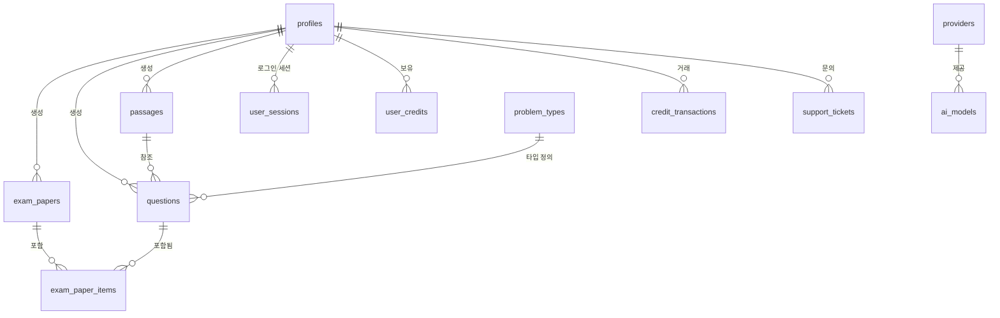

# 프로젝트 아키텍처 및 일관성 가이드

이 문서는 `create_quiz_ai` 프로젝트의 아키텍처와 데이터베이스 스키마에 대한 **유일한 진실의 원천(Single Source of Truth)** 역할을 합니다.
**목표**: 작업 중단 후 다시 시작할 때 발생할 수 있는 혼란, 코드 중복, 스키마 불일치를 방지합니다.

---

## 1. 기술 스택 개요
- **프레임워크**: Next.js (App Router)
- **언어**: TypeScript
- **데이터베이스 / 백엔드**: Supabase (PostgreSQL)
- **스타일링**: TailwindCSS (postcss.config.mjs 및 표준 관행에 따름)
- **AI 통합**: Gemini / OpenAI (`ai_models` 테이블을 통해 관리)

## 2. 디렉토리 구조 및 주요 파일

```text
.
├── src/
│   ├── app/                    # Next.js App Router (페이지 및 API)
│   │   ├── (admin)/            # 관리자 전용 레이아웃 및 페이지
│   │   ├── (auth)/             # 인증 관련 페이지 (로그인, 회원가입)
│   │   ├── (dashboard)/        # 메인 어플리케이션 기능 (문제은행, 라이브러리 등)
│   │   ├── api/                # 백엔드 API 엔드포인트
│   │   ├── auth/               # Supabase 인증 콜백
│   │   ├── globals.css         # 글로벌 스타일
│   │   └── layout.tsx          # 루트 레이아웃
│   ├── components/             # 공통 및 기능별 컴포넌트
│   │   ├── admin/              # 관리자 전용 컴포넌트
│   │   ├── features/           # 도메인별 복합 컴포넌트 (bank, quiz 등)
│   │   ├── layout/             # 헤더, 푸터, 사이드바 등 레이아웃 컴포넌트
│   │   └── ui/                 # Shadcn UI (원자적 컴포넌트)
│   ├── lib/                    # 유틸리티 및 라이브러리 설정
│   │   ├── ai/                 # AI 모델 연동 (OpenAI, Gemini)
│   │   └── supabase/           # Supabase 클라이언트/서버 설정
│   ├── types/                  # TypeScript 타입 정의
│   │   └── supabase.ts         # DB 스키마 자동 생성 타입
│   └── utils/                  # 공통 헬퍼 함수
├── supabase/                   # Supabase 관련 설정 및 마이그레이션
├── PROJECT_RULES.md            # 프로젝트 개발 규칙
└── project_architecture.md     # (현재 파일) 프로젝트 구조 요약
```

---

## 3. 데이터베이스 스키마 (ERD)

**진실의 원천**: Supabase 프로젝트 (`kzcweelnzhcmiuvjgeyi`)

### 관계 다이어그램 (Mermaid)



### 테이블 및 컬럼 상세 정의

#### 1) `profiles` (사용자 프로필)
`auth.users`를 확장한 사용자 정보 테이블입니다.
| 컬럼명 | 타입 | 설명 |
| :--- | :--- | :--- |
| `id` | `uuid` (PK) | `auth.users.id`와 연결 |
| `email` | `text` | 사용자 이메일 |
| `name` | `text` | 이름 |
| `phone` | `text` | 전화번호 |
| `birthdate` | `date` | 생년월일 |
| `organization`| `text` | 소속 기관 |
| `gender` | `text` | 성별 |
| `address` | `text` | 주소 |
| `role` | `text` | 역할 (teacher, academy_instructor) |
| `is_admin` | `boolean` | 관리자 여부 |
| `provider` | `text` | 가입 경로 (email, kakao 등) |
| `kakao_id` | `text` | 카카오 고유 ID |
| `kakao_email` | `text` | 카카오 이메일 |
| `avatar_url` | `text` | 프로필 이미지 URL |
| `created_at` | `timestamptz`| 생성일시 |
| `updated_at` | `timestamptz`| 수정일시 |

#### 2) `passages` (영어 지문)
재사용 가능한 영어 지문 및 메타데이터를 저장합니다.
| 컬럼명 | 타입 | 설명 |
| :--- | :--- | :--- |
| `id` | `uuid` (PK) | 지문 고유 ID |
| `user_id` | `uuid` (FK) | 소유자 ID |
| `content` | `text` | 영어 지문 본문 |
| `title_en` | `text` | 영어 제목 |
| `title_ko` | `text` | 한글 제목 |
| `content_translation`| `text` | 한글 번역본 |
| `tags` | `text[]` | 태그 배열 |
| `is_bookmarked`| `boolean` | 북마크 여부 |
| `source_type` | `text` | 출처 종류 (textbook, mock_exam 등) |
| `source_1` | `text` | 출처 1 (예: 과목명/연도) |
| `source_2` | `text` | 출처 2 (예: 출판사/월) |
| `source_3` | `text` | 출처 3 (예: 학년) |
| `source_4` | `text` | 출처 4 (예: 단원/번호) |
| `created_at` | `timestamptz`| 생성일시 |
| `updated_at` | `timestamptz`| 수정일시 |

#### 3) `questions` (질문/문제)
개별 문제 데이터를 저장합니다. `passages` 테이블을 참조할 수 있습니다.
| 컬럼명 | 타입 | 설명 |
| :--- | :--- | :--- |
| `id` | `uuid` (PK) | 문제 고유 ID |
| `user_id` | `uuid` (FK) | 생성한 사용자 ID |
| `passage_id` | `uuid` (FK) | 연결된 지문 ID (Optional) |
| `question_text`| `text` | 문제 지문/발문 |
| `passage_text` | `text` | (레거시) 보기 지문, `passage_id` 사용 권장 |
| `choices` | `jsonb` | 선지 데이터 |
| `answer` | `text` | 정답 |
| `explanation` | `text` | 해설 |
| `difficulty` | `text` | 난이도 |
| `grade_level` | `text` | 학년/수준 |
| `problem_type_id`| `uuid` (FK) | 문제 유형 ID |
| `source` | `varchar` | 생성 출처 (ai_generated 등) |
| `raw_ai_response`| `text` | AI가 생성한 원본 응답 |
| `question_text_forward` | `text` | 앞부분 지문 (필요 시) |
| `question_text_backward` | `text` | 뒷부분 지문 (필요 시) |
| `shared_question_id`| `uuid` | 공유된 원본 문제 ID |
| `tags` | `text[]` | 태그 배열 |
| `rating` | `smallint` | 사용자 평점 (0-3 등) |
| `source_type` | `text` | 출처 종류 (지문 정보 상속) |
| `source_1` | `text` | 출처 1 |
| `source_2` | `text` | 출처 2 |
| `source_3` | `text` | 출처 3 |
| `source_4` | `text` | 출처 4 |
| `created_at` | `timestamptz`| 생성일시 |
| `updated_at` | `timestamptz`| 수정일시 |

#### 4) `exam_papers` (시험지/꾸러미)
여러 문제를 묶은 시험지 단위입니다.
| 컬럼명 | 타입 | 설명 |
| :--- | :--- | :--- |
| `id` | `uuid` (PK) | 시험지 고유 ID |
| `user_id` | `uuid` (FK) | 소유자 ID |
| `paper_title` | `text` | 시험지 명칭 |
| `description` | `text` | 상세 설명 |
| `created_at` | `timestamptz`| 생성일시 |
| `updated_at` | `timestamptz`| 수정일시 |

#### 5) `exam_paper_items` (시험지 구성 요소)
시험지와 문제를 연결하는 중간 테이블입니다.
| 컬럼명 | 타입 | 설명 |
| :--- | :--- | :--- |
| `id` | `uuid` (PK) | 고유 ID |
| `exam_paper_id`| `uuid` (FK) | 연결된 시험지 ID |
| `question_id` | `uuid` (FK) | 연결된 문제 ID |
| `number` | `integer` | 시험지 내 문제 번호 |
| `order_index` | `integer` | 정렬 순서 |
| `created_at` | `timestamptz`| 생성일시 |

#### 6) `problem_types` (문제 유형 설정)
문제 생성 시 사용되는 프롬프트 및 유형 정보입니다.
| 컬럼명 | 타입 | 설명 |
| :--- | :--- | :--- |
| `id` | `uuid` (PK) | 고유 ID |
| `type_name` | `text` | 유형 이름 |
| `description` | `text` | 유형 설명 |
| `provider` | `text` | 사용 AI 제공자 |
| `model_name` | `text` | 사용 AI 모델명 |
| `prompt_template`| `text` | 생성 프롬프트 템플릿 |
| `output_format` | `text` | 기대 응답 형식 |
| `is_active` | `boolean` | 활성화 여부 |
| `created_at` | `timestamptz`| 생성일시 |
| `updated_at` | `timestamptz`| 수정일시 |

#### 7) `source_configs` (출처 설정)
동적 출처 관리 및 필터링을 위한 설정 테이블입니다.
| 컬럼명 | 타입 | 설명 |
| :--- | :--- | :--- |
| `id` | `uuid` (PK) | 고유 ID |
| `type_name` | `text` | 출처 종류 이름 (Unique) |
| `source_1_label` | `text` | 출처 1 라벨 |
| `source_1_options`| `text[]` | 출처 1 선택 옵션 |
| `source_2_label` | `text` | 출처 2 라벨 |
| `source_2_options`| `text[]` | 출처 2 선택 옵션 |
| `source_3_label` | `text` | 출처 3 라벨 |
| `source_3_options`| `text[]` | 출처 3 선택 옵션 |
| `source_4_label` | `text` | 출처 4 라벨 |
| `source_4_options`| `text[]` | 출처 4 선택 옵션 |
| `created_at` | `timestamptz`| 생성일시 |

#### 8) `user_sessions` (세션 관리)
| 컬럼명 | 타입 | 설명 |
| :--- | :--- | :--- |
| `id` | `uuid` (PK) | 세션 ID |
| `user_id` | `uuid` (FK) | 사용자 ID |
| `device_info` | `text` | 디바이스 정보 |
| `ip_address` | `text` | IP 주소 |
| `is_current` | `boolean` | 현재 세션 여부 |
| `last_active` | `timestamptz`| 마지막 활동 |

#### 9) `user_credits` (크레딧 잔액)
| 컬럼명 | 타입 | 설명 |
| :--- | :--- | :--- |
| `id` | `uuid` (PK) | ID |
| `user_id` | `uuid` (FK) | 사용자 ID |
| `balance` | `integer` | 크레딧 잔액 |

#### 10) `credit_transactions` (크레딧 거래)
| 컬럼명 | 타입 | 설명 |
| :--- | :--- | :--- |
| `id` | `uuid` (PK) | ID |
| `user_id` | `uuid` (FK) | 사용자 ID |
| `type` | `text` | 거래 유형 (charge, use_...) |
| `amount` | `integer` | 변동 금액 (+/-) |
| `balance_after` | `integer` | 변동 후 잔액 |
| `description` | `text` | 설명 |
| `reference_id` | `uuid` | 관련 엔티티 ID |

#### 11) `support_tickets` (고객 지원)
| 컬럼명 | 타입 | 설명 |
| :--- | :--- | :--- |
| `id` | `uuid` (PK) | 티켓 ID |
| `subject` | `text` | 제목 |
| `message` | `text` | 내용 |
| `status` | `text` | 상태 (pending, resolved) |
| `admin_response`| `text` | 관리자 답변 |

#### 12) `display_labels` (UI 라벨)
| 컬럼명 | 타입 | 설명 |
| :--- | :--- | :--- |
| `id` | `uuid` (PK) | ID |
| `category` | `varchar` | 라벨 카테고리 |
| `db_value` | `varchar` | DB 저장 값 |
| `display_value` | `varchar` | 화면 표시 이름 |
| `sort_order` | `integer` | 정렬 순서 |

---

## 4. 개발 워크플로우 및 일관성 규칙

### 규칙 1: 절대 무작정 테이블을 만들지 마세요
새로운 기능을 정의하기 전에, **항상** 이 문서와 `src/types/supabase.ts`를 확인하여 이미 존재하는 테이블인지 확인하세요.

### 규칙 2: 스키마 변경의 진실의 원천
이상적으로는 Supabase Migrations (`supabase/migrations`)를 사용하여 변경해야 합니다.
대시보드에서 직접 수정한 경우, 즉시 **타입 생성(Type Generation)** 명령어를 실행하여 로컬 코드를 동기화하세요.

### 규칙 3: 타입 동기화 (가장 권장하는 방법)
DB 스키마를 변경할 때마다 아래 명령어를 실행하여 로컬 타입을 업데이트하세요.
```bash
npx supabase gen types typescript --project-id kzcweelnzhcmiuvjgeyi > src/types/supabase.ts
```

### 규칙 4: 이 문서 업데이트
테이블이나 컬럼을 추가하면, 즉시 `project_architecture.md` 파일을 업데이트하세요.
