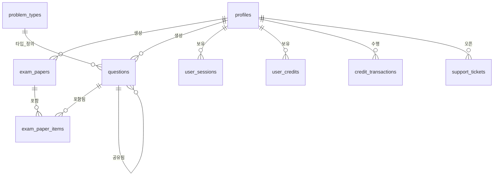

# 프로젝트 아키텍처 및 일관성 가이드

이 문서는 `create_quiz_ai` 프로젝트의 아키텍처와 데이터베이스 스키마에 대한 **유일한 진실의 원천(Single Source of Truth)** 역할을 합니다.
**목표**: 작업 중단 후 다시 시작할 때 발생할 수 있는 혼란, 코드 중복, 스키마 불일치를 방지합니다.

---

## 1. 기술 스택 개요
- **프레임워크**: Next.js (App Router)
- **언어**: TypeScript
- **데이터베이스 / 백엔드**: Supabase (PostgreSQL)
- **스타일링**: TailwindCSS (postcss.config.mjs 및 표준 관행에 따름)
- **AI 통합**: Gemini / OpenAI (`ai_models` 테이블을 통해 관리)

## 2. 디렉토리 구조 및 통합 포인트

### Supabase 통합
- **클라이언트 설정**:
  - `src/lib/supabase/client.ts`: 클라이언트 사이드 Supabase 클라이언트.
  - `src/lib/supabase/server.ts`: 서버 사이드 Supabase 클라이언트 (쿠키 사용).
- **타입 정의**:
  - `src/types/supabase.ts`: **자동 생성된 데이터베이스 타입**. 모든 코드는 반드시 이 타입을 사용해야 합니다.

### 주요 로직 위치
- `/src/app`: 애플리케이션 라우트 및 페이지.
- `/supabase`: (존재 시) 마이그레이션 또는 설정 파일.

---

## 3. 데이터베이스 스키마 (ERD)

**현재 상태**: 활성 & 연결됨.
**진실의 원천**: Supabase 프로덕션 데이터베이스 (`kzcweelnzhcmiuvjgeyi`) & `src/types/supabase.ts`.

### 관계 다이어그램 (Mermaid)



### 테이블 정의

#### 핵심 사용자 및 신원 관리
| 테이블명 | 설명 | 주요 컬럼 |
| :--- | :--- | :--- |
| **`profiles`** | `auth.users` 확장. 사용자 신원 및 프로필 데이터. | `id` (PK, FK to auth.users), `email`, `role`, `credits` |
| **`user_sessions`** | 활성 사용자 세션 추적. | `id`, `user_id`, `device_info`, `ip_address` |
| **`user_credits`** | 사용자 크레딧 잔액. | `id`, `user_id` (Unique), `balance` |
| **`credit_transactions`** | 크레딧 사용/충전 내역. | `id`, `user_id`, `amount`, `type` |

#### 퀴즈 핵심
| 테이블명 | 설명 | 주요 컬럼 |
| :--- | :--- | :--- |
| **`exam_papers`** | 퀴즈/시험지를 구성하는 질문 그룹. | `id`, `user_id`, `paper_title`, `description` |
| **`questions`** | 개별 질문. | `id`, `question_text`, `answer`, `choices` (JSON), `problem_type_id` |
| **`exam_paper_items`** | 질문과 시험지를 연결하는 중간 테이블. | `id`, `exam_paper_id`, `question_id`, `order_index` |
| **`problem_types`** | 질문 유형 설정 (예: 객관식, 주관식). | `id`, `type_name`, `prompt_template`, `output_format` |

#### 설정 및 메타 데이터
| 테이블명 | 설명 | 주요 컬럼 |
| :--- | :--- | :--- |
| **`ai_models`** | 생성에 사용 가능한 AI 모델. | `id`, `name`, `provider`, `display_order` |
| **`providers`** | AI 서비스 제공자 (OpenAI, Gemini). | `id`, `name`, `is_active` |
| **`admin_logs`** | 시스템 감사 로그. | `id`, `user_id`, `type`, `details` |
| **`support_tickets`** | 사용자 문의/지원 요청. | `id`, `user_id`, `subject`, `status` |

---

## 4. 개발 워크플로우 및 일관성 규칙

작업 복귀 시 "중복 테이블 생성"이나 "스키마 불일치"를 방지하기 위한 규칙입니다:

### 규칙 1: 절대 무작정 테이블을 만들지 마세요
새로운 기능을 정의하기 전에, **항상** 이 문서와 `src/types/supabase.ts`를 확인하여 이미 존재하는 테이블인지 확인하세요.

### 규칙 2: 스키마 변경의 진실의 원천
이상적으로는 Supabase Migrations (`supabase/migrations`)를 사용하여 변경해야 합니다.
대시보드에서 직접 수정한 경우, 즉시 **타입 생성(Type Generation)** 명령어를 실행하여 로컬 코드를 동기화하세요.

### 규칙 3: 타입 동기화 (가장 권장하는 방법)
DB 스키마를 변경할 때마다 아래 명령어를 실행하여 로컬 타입을 업데이트하세요. 이렇게 하면 코드가 DB 변경 사항을 즉시 "인지"할 수 있습니다.

```bash
npx supabase gen types typescript --project-id kzcweelnzhcmiuvjgeyi > src/types/supabase.ts
```
*(참고: `npx supabase login`으로 로그인되어 있거나 액세스 토큰이 필요할 수 있습니다)*

### 규칙 4: 이 문서 업데이트
테이블이나 컬럼을 추가하면, 즉시 `project_architecture.md` 파일을 업데이트하세요.

---

## 5. 유지보수 체크리스트 (작업 재개 시)
1. **`task.md` 확인**: 완료되지 않은 작업이 무엇인지 확인합니다.
2. **최신 코드 Pull**: git 상태가 동기화되어 있는지 확인합니다.
3. **최신 타입 Pull**: 타입 생성 명령어를 실행하여 로컬 타입이 원격 DB와 일치하는지 확인합니다.
4. **비교**: `project_architecture.md`가 현재 `src/types/supabase.ts` 내용을 포함하고 있는지 확인합니다. 그렇지 않다면 문서를 먼저 업데이트하세요.
